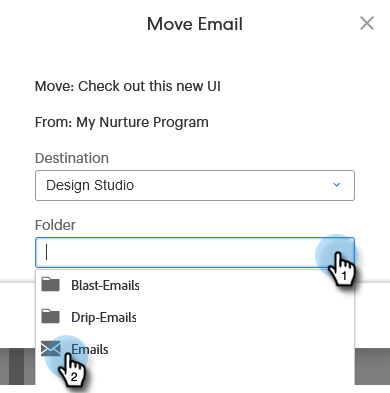
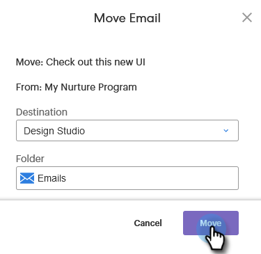

# Moving Assets {#moving-assets}

Drag and drop is not currently available, but you can still easily relocate assets.

>[!NOTE]
>
>Folders in the Design Studio can be moved within the same workspace, but not across workspaces at this time.

1. In the tree, locate the asset you want moved. Right-click on it and select **Move**.

   

1. Choose the destination section.

   

>[!NOTE]
>
>Subsequent options in this modal may change based on the **destination** you choose.

1. Choose the destination folder.

   

1. Click **Move**.

   

Simple as that!
