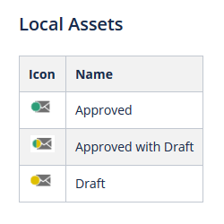
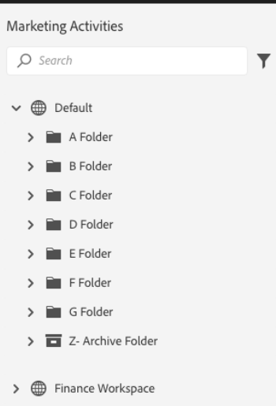

# Overview {#overview}

Welcome to the next-gen Marketo Engage experience, a new interface that provides enhanced usability along with a new look and feel across the Marketo platform.

>[!PREREQUISITES]
>
>If your IT team restricts web access using an allowlist, ask them to add the following domains (including the asterisk) to allow all Marketo resources and websockets:
>
>* *.marketo.com
>* *.marketodesigner.com
>* *.mktoweb.com

## Take the Tour {#take-the-tour}

At first log-in, a pop-up will appear, ready to give you the rundown of the new experience. Heads up, if you choose to skip it, it will **not** be available later.

The tour walks you through everything you need to know!

## What's New {#whats-new}

There's a lot of new functionality in this next-gen experience, all of which is designed to significantly improve your marketing experience.

**Icons**

The new interface features improved and expanded iconography. Learn about them here: [New Icon Glossary](/help/marketo/product-docs/marketo-engage-next-generation-experience/new-icon-glossary.md).

**Tree**

The tree has been upgraded, too. But at this time, dragging and dropping is not available. You can still move assets, however. Learn how: [Moving Assets](/help/marketo/product-docs/marketo-engage-next-generation-experience/moving-assets.md).

**Global Navigation**

Goodbye superball. You now have quick access to all of the main Marketo sections.

**Instance URL**

You also have quick access to your munchkin ID, which is now reflected in your instance's URL (even more helpful to those with multiple subscriptions).

## New Tree Options {#new-tree-options}

There are a ton of new tree features available.

**Marketo Classic vs. the New Marketo**

<table> 
 <tbody>
  <tr>
   <th>Feature</th> 
   <th>Classic</th> 
   <th>Next-gen</th> 
  </tr>
  <tr>
   <td>Apply multiple filters at the same time</td> 
   <td></td> 
   <td><strong>X</strong></td>  
  </tr>
  <tr>
   <td>Combined draft and approval tree node</td> 
   <td></td> 
   <td><strong>X</strong></td> 
  </tr>
  <tr>
   <td>Create local assets in program folders</td> 
   <td></td> 
   <td><strong>X</strong></td> 
  </tr>
  <tr>
   <td>Double-click to expand/collapse tree nodes</td> 
   <td><strong>X</strong></td> 
   <td><strong>X</strong></td>  
  </tr>
  <tr>
   <td>Drag-and-drop from tree to engagement stream</td> 
   <td><strong>X</strong></td> 
   <td>hhhhhhhhh</td> 
  </tr>
  <tr>
   <td>Drag-and-drop inside the tree</td> 
   <td><strong>X</strong></td> 
   <td></td> 
  </tr>
  <tr>
   <td>Filter by asset type and states</td> 
   <td><i>partial</i></td> 
   <td><strong>X</strong></td>  
  </tr>
  <tr>
   <td>Highlight background to show hierarchy in focus state</td> 
   <td></td> 
   <td><strong>X</strong></td> 
  </tr>
  <tr>
   <td>Highlighting keywords during search</td> 
   <td></td> 
   <td><strong>X</strong></td> 
  </tr>
  <tr>
   <td>Horizontal scroll</td> 
   <td><strong>X</strong></td> 
   <td><strong>X</strong></td>  
  </tr>
  <tr>
   <td>Hover state of tree nodes</td> 
   <td><strong>X</strong></td> 
   <td><strong>X</strong></td> 
  </tr>
  <tr>
   <td>Quick collapse entire tree</td> 
   <td></td> 
   <td><strong>X</strong></td> 
  </tr>
  <tr>
   <td>Quickly collapse to root node</td> 
   <td></td> 
   <td><strong>X</strong></td>  
  </tr>
  <tr>
   <td>Real-time update</td> 
   <td></td> 
   <td><strong>X</strong></td> 
  </tr>
  <tr>
   <td>Resizeable tree</td> 
   <td><strong>X</strong></td> 
   <td><strong>X</strong></td> 
  </tr>
  <tr>
   <td>Search in archived folders</td> 
   <td></td> 
   <td><strong>X</strong></td>  
  </tr>
  <tr>
   <td>Search string saved when entering global search from tree search</td> 
   <td></td> 
   <td><strong>X</strong></td> 
  </tr>
  <tr>
   <td>Show all workspaces in a single tree</td> 
   <td><strong>X</strong></td> 
   <td><strong>X</strong></td> 
  </tr>
  <tr>
   <td>State badge and tooltips</td> 
   <td></td> 
   <td><strong>X</strong></td>  
  </tr>
  <tr>
   <td>'Word starts with' search logic</td> 
   <td><strong>X</strong></td> 
   <td><strong>X</strong></td> 
  </tr>
 </tbody>
</table>

## Global Nav {#global-nav}

Take a look at the new Global Nav.

<table> 
 <tbody>
  <tr>
   <td>1</td> 
   <td>No more superball drop-down</td> 
  </tr>
  <tr>
   <td>2</td> 
   <td>All previous superball items listed out</td> 
  </tr>
  <tr>
   <td>3</td> 
   <td>Use this to provide feedback about your MEUE experience</td> 
  </tr>
  <tr>
   <td>4</td> 
   <td>If you have multiple subscriptions, click on your sub name to easily switch to another one</td> 
  </tr>
  <tr>
   <td>5</td> 
   <td>Global search - you can now search your entire instance from here</td> 
  </tr>
 </tbody>
</table>

>[!NOTE]
>
>Everything that used to live in the superball drop-down is still available as a tile in your My Marketo.

>[!TIP]
>
>Using the search in the tree will only yield results from the section you're in (e.g., Marketing Activities). If you'd like to search your entire instance, use the global search.

Enjoy the new Marketo Engage experience, and be sure to share your feedback!
