# Toggle Switch {#toggle-switch}

The Toggle Switch allows you to switch between Marketo's classic interface and the new next-gen Marketo Engage experience. It's available in the Landing Page List View and on Form detail pages.

>[!NOTE]
>
>When the Toggle Switch is selected, all existing workflows will be autosaved prior to the UI change occurring. If an operation is already in progress (ex: an asset is in the process of being approved), you'll receive an error message indicating as such and should try again after the operation is completed.

## Enable the Toggle Switch for Individual Roles {#enable-the-toggle-switch-for-individual-roles}

Enable the toggle switch for individual roles or all roles. Here's how.

1. In Marketo Engage, click **Admin**.

   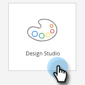

1. Click **New Experience**.

   

1. Select the role(s) you want to have access to the toggle switch.

   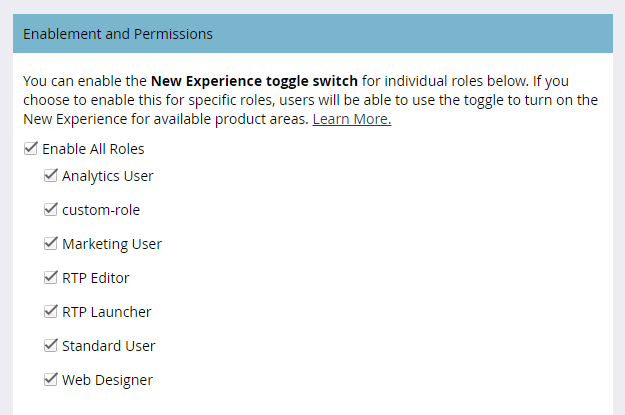

## Landing Page List View {#landing-page-list-view}

The next-gen Landing Page list view offers search filters and the ability to perform mass Landing Page actions.

1. In Marketo, select **Design Studio**.

   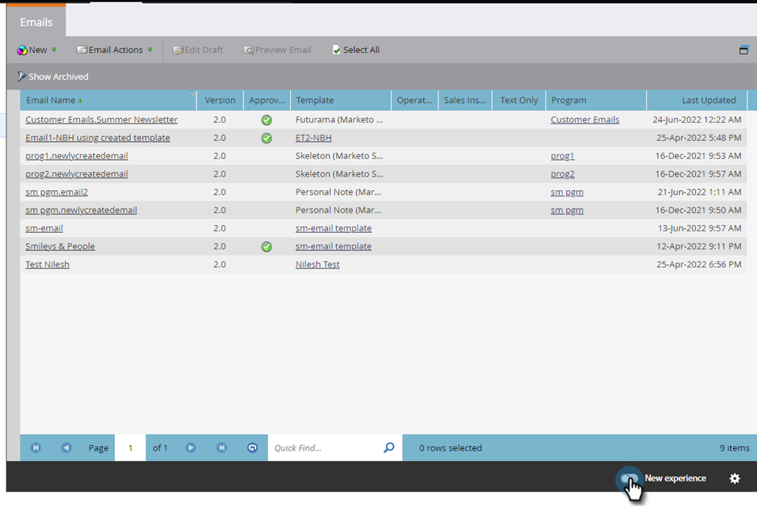

1. Select **Landing Pages**.

   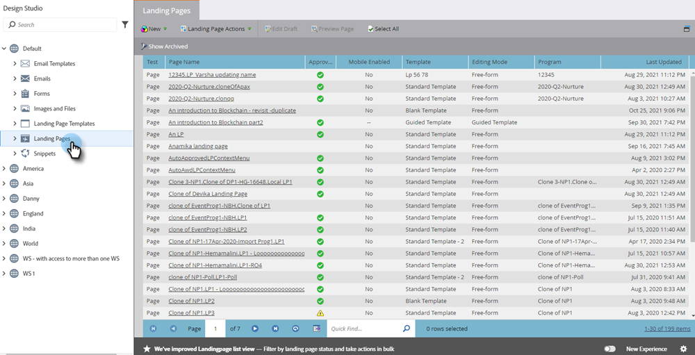

1. In the bottom-right of the page, click the **New Experience** toggle.

   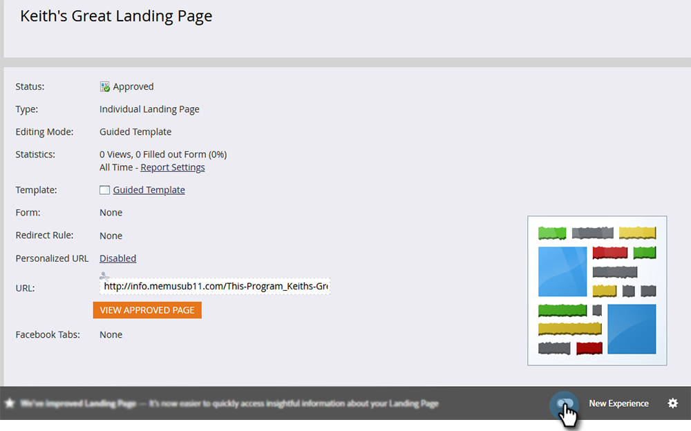

The new experience will load.

   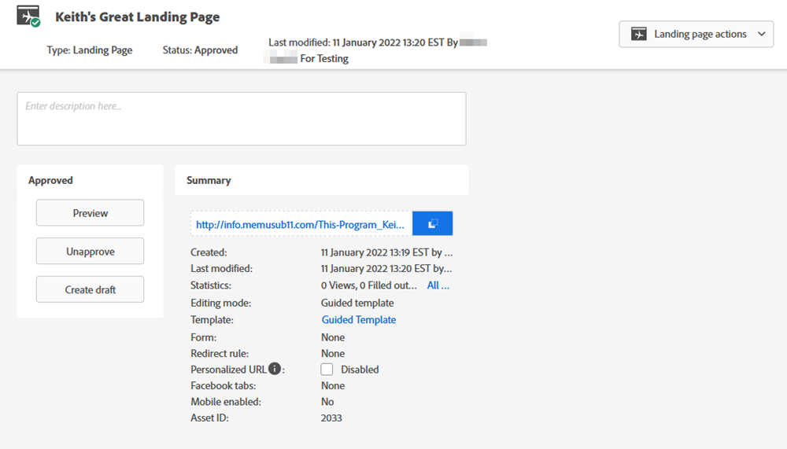

## Landing Page Details Page {#landing-page-details-page}

1. In Marketo, find and select your Landing Page.

   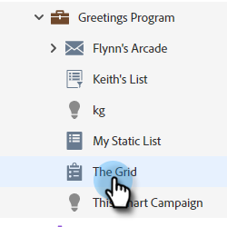

1. In the bottom-right of the page, click the **New Experience** toggle.

   

The new experience will load.

   

## Form Details Page {#form-details-page}

1. In Marketo, find and select your form.

   

1. In the bottom-right of the page, click the **New Experience** toggle.

   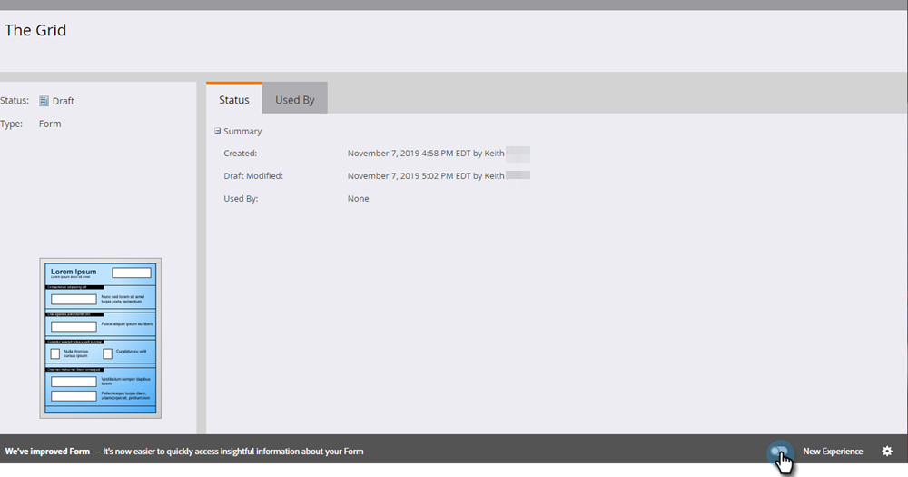

The new experience will load.

   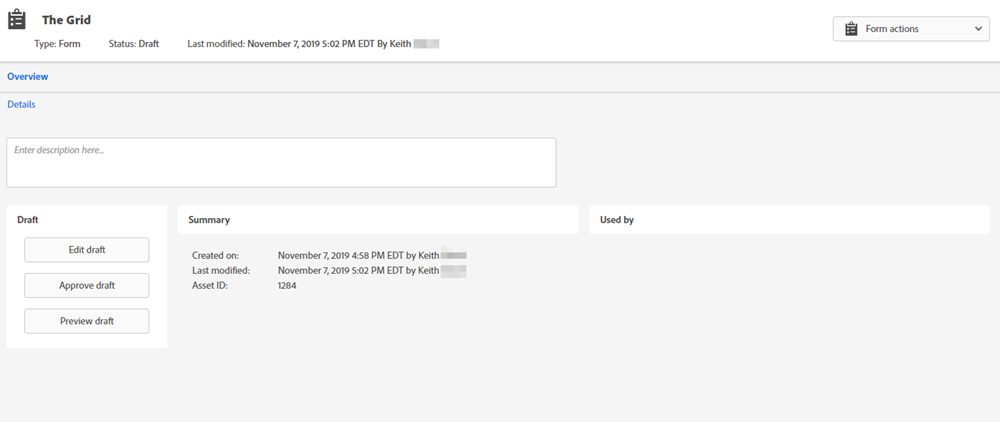

## Form List View {#form-list-view}

1. In Marketo, select **Design Studio**.

   

1. Select **Forms**.

   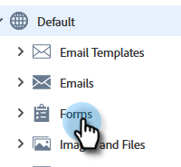

1. In the bottom-right of the page, click the **New Experience** toggle.

   

The new experience will load.

   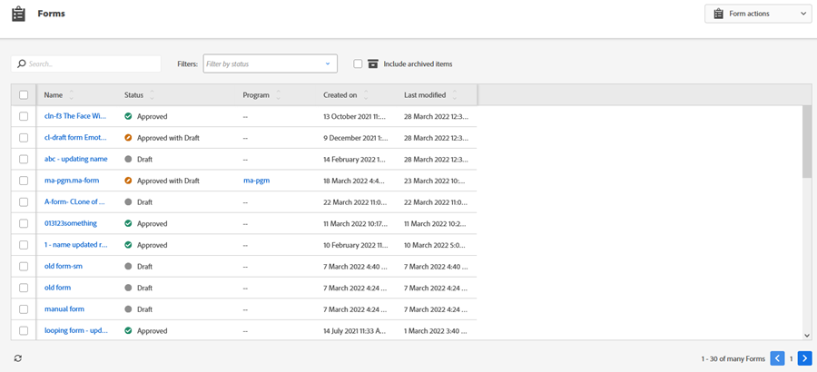

## Enable for All Features {#enable-for-all-features}

You have the option of enabling Marketo's next-gen interface for all available features, current and forthcoming.

1. In an area that currently has the Toggle Switch (in this example we're in [Form Details Page](#form-details-page)), click the gear icon in the bottom-right of the page.

   

1. Select **Enable for all available features** and click **OK**.

   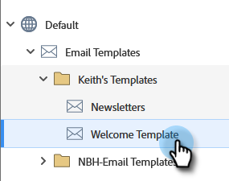
