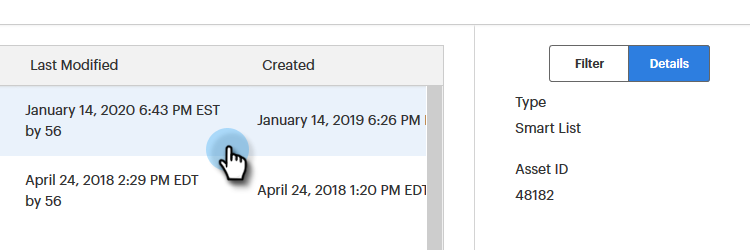

# Using the Global Search {#using-the-global-search}

The powerful global search gives you plenty of options. Let's go over them.

## Autocomplete Results {#autocomplete-results}

Sometimes autocomplete will quickly show you exactly what you're looking for.

1. In the Global Nav, click **Search**.

   

1. Type in identifying text for your asset.

   

1. Autocomplete search results appear. You can click anywhere in any of the breadcrumbs to be taken directly to that item.

   

1. In this example, we're choosing to be taken directly to the list we're looking for. Click the list's name.

   

You're taken directly to the desired list.

   

## Global Search Results {#global-search-results}

Use the full search if autocomplete results don't show you what you're looking for.

1. In the Global Nav, click **Search**.

   

1. Type in identifying text for your asset and click **Search**.

   

1. The Global Search Results page will open.

   

<table> 
 <tbody>
  <tr>
   <td>1</td> 
   <td>First (or only) page of all your search results, click anywhere in any of the breadcrumbs to be taken straight to that area</td> 
  </tr>
  <tr>
   <td>2</td> 
   <td>Dates/times the item was created/last modified</td> 
  </tr>
  <tr>
   <td>3</td> 
   <td>Choose a specific main Marketo section to search, or search all at once</td> 
  </tr>
  <tr>
   <td>4</td> 
   <td>Implement focused filters to narrow search results</td> 
  </tr>
 </tbody>
</table>

OPTIONAL STEP: To utilize filtering, choose your options and click **Apply**.

   

OPTIONAL STEP: To see an item's details, click in the "white space" of its row.

   

OPTIONAL STEP: To go directly to the last item in a breadcrumb, click on it, OR, mouse over the "white space" in its row until the icon below appears, and click on that.

   
