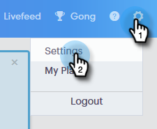
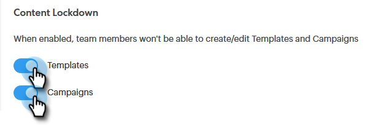

# Content Lockdown {#content-lockdown}

By enabling content lockdown, restrict non-admin users from editing templates and/or campaigns. Users will not be able to: share, clone, edit, or delete content. They also won't have the option to archive templates.

>[!NOTE]
>
>Users **will** still be able to edit the content of an email at the time of sending, or when launching a campaign.

1. In [!UICONTROL Sales Connect], click the settings icon and select **[!UICONTROL Settings]**.

   

1. Under [!UICONTROL Admin Settings], click **[!UICONTROL General]**.

   

1. Scroll down to [!UICONTROL Content Lockdown]. Turning either slider on will _disable_ your team members' ability to create/edit templates and/or campaigns.

   
