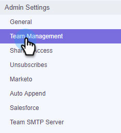
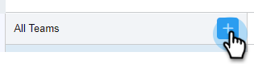
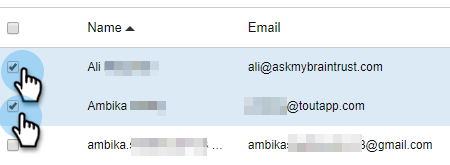

# Create a Sub-Team {#create-a-sub-team}

## Create a Sub-Team {#create-a-sub-team-1}

1. Click the gear icon and select **[!UICONTROL Settings]**.

   

1. Under [!UICONTROL Admin Settings], select **[!UICONTROL Team Management]**.

   

1. Next to [!UICONTROL All Teams], click the **+**.

   

1. Enter a team name (and optional description) and click **[!UICONTROL Create]**.

   

   >[!NOTE]
   >
   >You can now share templates, campaigns and groups with that team.

## Add People to Your Sub-Team {#add-people-to-your-sub-team}

1. Still in [!UICONTROL Team Management], select the **[!UICONTROL Everyone]** group.

   

1. Locate the users you want added to your sub-team and select their checkbox.

   

1. Click **[!UICONTROL Add Selected to Teams]**.

   

1. Click the drop-down and select your desired team(s).

   

1. Click **[!UICONTROL Add To Teams]** when done.

   
