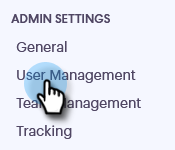
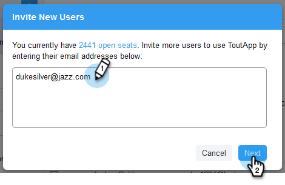
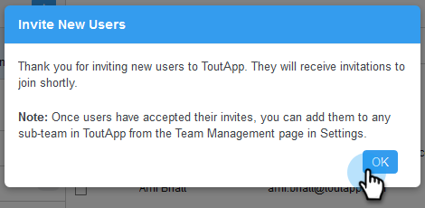

# Invite Team Members {#invite-team-members}

Adding team members is quick and easy!

1. Click the gear icon and select **Settings**.

   

1. Under Admin Settings, select **User Management**.

   

1. Click **Invite Users**.

   

1. Enter the email addresses of the individuals you'd like to add and click **Next**.

   

   >[!NOTE]
   >
   >By default, all new members will be added to the Everyone team.

1. Click **OK**.

   
