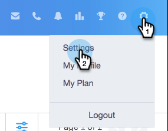

# Sharing Settings {#sharing-settings}

Better manage your templates by restricting what users can share and with which categories.

When your Sales Connect account is first created, [!UICONTROL Sharing Settings] are enabled. This gives your account admins the opportunity to create and organize your template categories before opening the floodgates and allowing users to share content into your team categories.

When [!UICONTROL Sharing Settings] are enabled, only admins will be able to share into categories unless sharing privileges are provided to a team or everyone. With [!UICONTROL Sharing Settings] disabled, there are no restrictions and all users can share into any template categories.

## Configure Your Sharing Settings {#configure-your-sharing-settings}

1. In the the [web application](https://toutapp.com/login), go to the [!UICONTROL Settings] page.

   

1. Under [!UICONTROL Admin Settings], select **[!UICONTROL Sharing Access]**.

   

1. Make sure **[!UICONTROL Sharing Settings]** are enabled. This means by default, only admins will be able to share templates in your template categories.

   

1. Select the Template Category you want to configure.

   

1. Click **[!UICONTROL Add Teams for Access]**.

   

1. Select the teams you want to add.

   

   >[!NOTE]
   >
   >If you don't see any teams, you'll need to go to Team Management and create a team of users.

1. Click **[!UICONTROL Add Teams for Access]** to save.

   

1. Now that your team has been added you can select to allow only team admins to share or all users on that team. In this example we gave all users on the SDR team sharing access.

   
