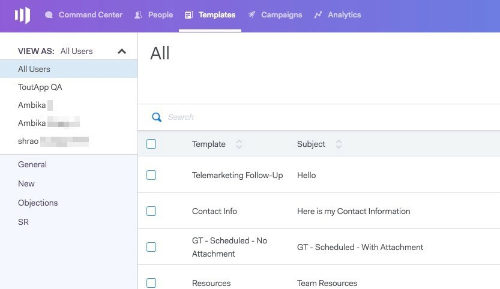
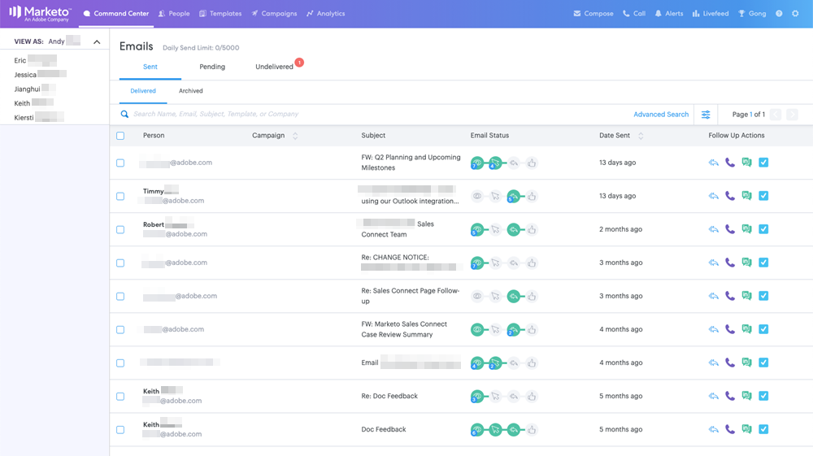
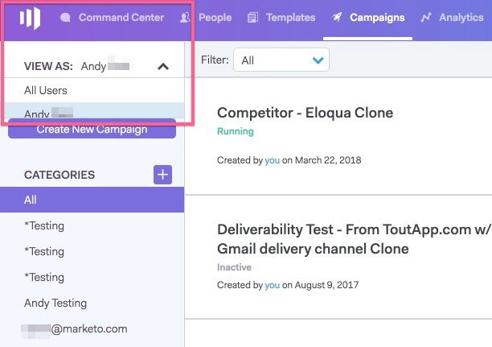

# User Access Details {#user-access-details}

What do Admins and non-Admins have access to?

## Admin User Permissions {#admin-user-permissions}

Admins can [view all templates](/help/marketo/product-docs/marketo-sales-connect/templates/view-template-list-as-another-user.md).

Admins can [view all campaigns](/help/marketo/product-docs/marketo-sales-connect/campaigns/view-campaigns-list-as-another-user.md).

Admins can view all email activity.

Admins can see all of the people on a running campaign.

All people records can be accessed in the Everyone group.

Admins can stop campaigns on behalf of users.

## Non-Admin User Permissions {#non-admin-user-permissions}

* Analytics:

    * Users can see team analytics
    * Users can drill into just the teams they belong to
    * Users can look at their own analytics

* Relationships Page:

    * Users can share groups with everyone
    * Users can share groups with just the teams they belong to
    * When a user is deleted, their shared contacts transfer ownership to the Master Admin who deleted the user

* Sales Beat - Next and Live Feed:

    * Users can view the ‘everyone’ view
    * Users can filter by the team(s) they belong to
    * User can share posts with everyone
    * Users can share posts with just the team(s) they belong to

* Team Management Page:

    * Cannot view

* Templates Page:

    * Users can share templates with everyone
    * Users can share templates in categories their Admins allow them to
    * When a user is removed from a team, their templates are unshared with that team
    * When a user is deleted from a team their templates transfer ownership to the Master Admin who deleted the user
