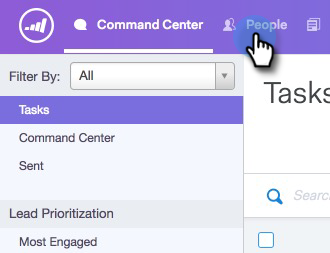
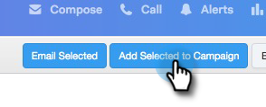
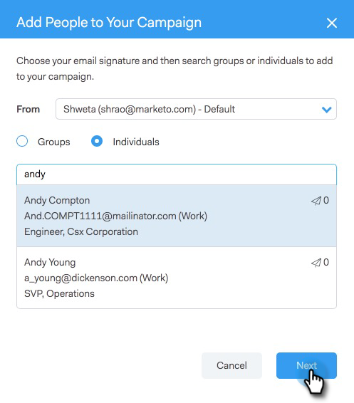
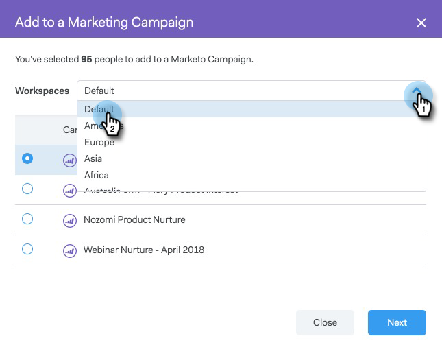
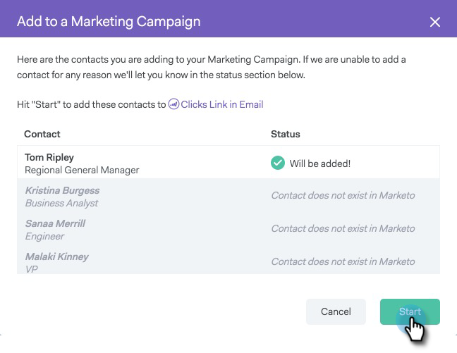
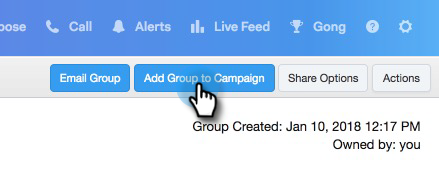

# Add to Marketing Campaign {#add-to-marketing-campaign}

>[!PREREQUISITES]
>
>[Make a Campaign Visible to Sales Users](/help/marketo/product-docs/marketo-sales-connect/marketo/make-a-campaign-visible-to-sales-connect-users.md)

## Add Individuals to a Campaign {#add-individuals-to-a-campaign}

>[!NOTE]
>
>In order to add a person to a Marketo Campaign from [!DNL Sales Connect], [!DNL Sales Connect] must have the person's Marketo lead ID.

1. Click the **[!UICONTROL People]** Tab.

   

1. Find the contact(s) you want to add.

   

1. Click the checkbox to select your contact(s).

   

1. Click **[!UICONTROL Add Selected to Campaign]**.

   

1. Since you're adding to a Marketing campaign, skip selecting a "from]" address. You can however choose to add more contacts. If you choose to, click **[!UICONTROL Individuals]** and type them in. Click **[!UICONTROL Next]** when done.

   

1. Click **[!UICONTROL Marketing Campaign]**.

   

1. Click the [!UICONTROL Workspaces] drop-down and choose the workspace that contains the campaign you want the group added to.

   

   >[!NOTE]
   >
   >If you don't see the workspace you want, make sure your Admin provisions it through your Marketo Team Access page.

1. Select the desired campaign and click **[!UICONTROL Next]**.

   

1. You're shown the contacts that qualify. Click **[!UICONTROL Start]** to get them added.

   

## Add a Group to a Campaign {#add-a-group-to-a-campaign}

1. Click the **[!UICONTROL People]** Tab.

   

1. Under [!UICONTROL My Groups], select the group you wish to add to a campaign.

   

1. Click **[!UICONTROL Add Group to Campaign]**.

   

1. Since you're adding to a Marketing campaign, skip selecting a "from" address. You can however choose to add more contacts. If you choose to, click **[!UICONTROL Individuals]** and type them in. Click **[!UICONTROL Next]** when done.

   

1. Select **[!UICONTROL Marketing Campaign]**.

   

   >[!NOTE]
   >
   >In order to add a person to a Marketo Campaign from [!UICONTROL Sales Connect], [!UICONTROL Sales Connect] must have the person's Marketo lead ID.

1. Click the **[!UICONTROL Workspaces]** drop-down and choose the workspace that contains the campaign you want the group added to.

   

   >[!NOTE]
   >
   >If you don't see the workspace you want, make sure your Admin provisions it through your Marketo Team Access page.

1. Select the desired campaign and click **[!UICONTROL Next]**.

   

1. You're shown the contacts that qualify. Click **[!UICONTROL Start]** to get them added.

   
