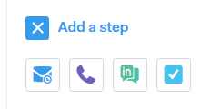
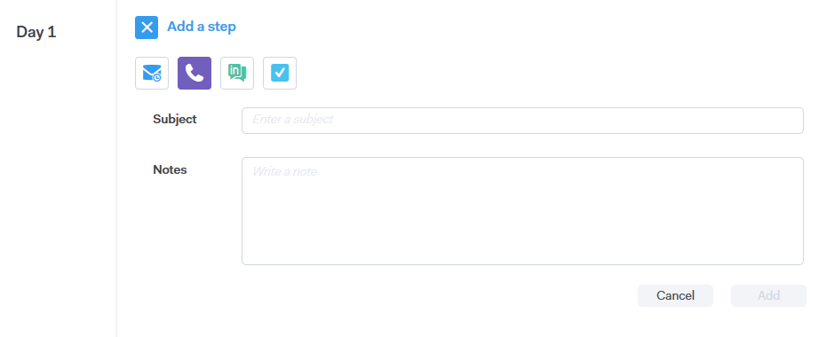
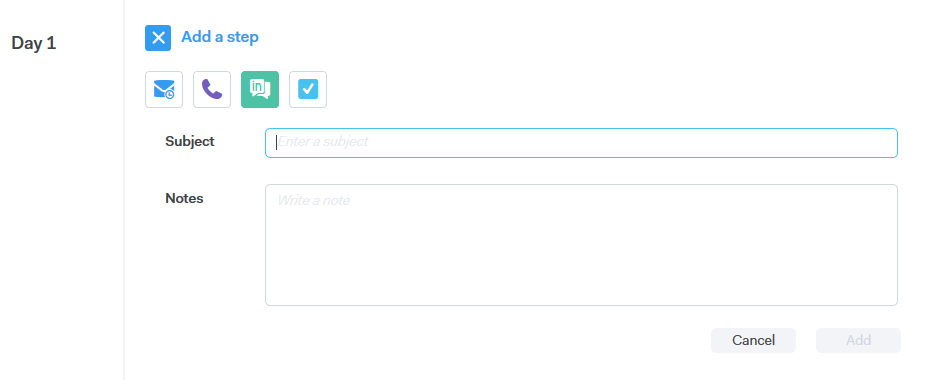
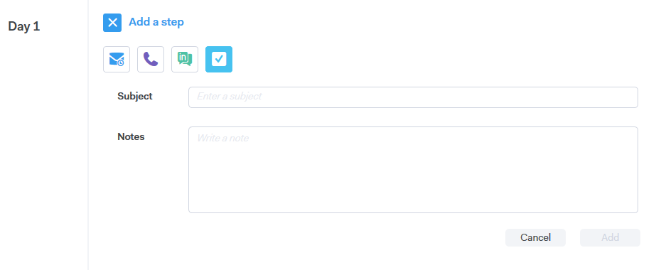

# Campaign Step Types {#campaign-step-types}

When adding a step to your campaign, you have four options.

## Email {#email}

Compose a new email, or use a pre-existing template.

| **Use a Template** |Select one of your pre-existing templates |
|---|---|
| **Save as Template** |Save the email you just composed as a new template |
| **Add Content** |Upload a file to our server and receive a URL (pointing to the content) that can be tracked in your email |
| **Attach Files** |Attach a file from your computer to the email (23MB size limit) |

>[!TIP]
>
>Learn the details about your [sending options](/help/marketo/product-docs/marketo-sales-connect/campaigns/understanding-send-options.md).

## Call {#call}

Set a reminder to follow-up with a contact via phone. You can also save notes to be used as a talk track during the call.

## InMail {#inmail}

Following up on multiple channels is a great way to connect with leads. With InMail tasks, you can set up a reminder to reach out via [!DNL LinkedIn].

## Custom Task {#custom-task}

Utilize custom tasks when the above options are not applicable. For example, you can invite a colleague to follow up with a lead via email.

