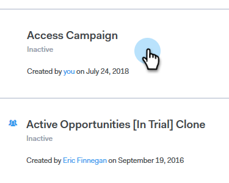
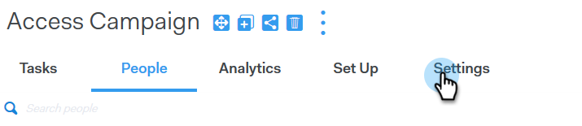
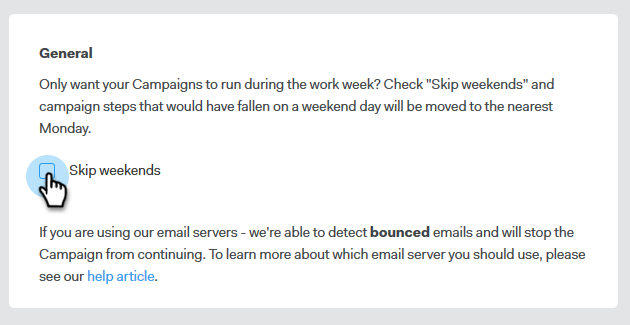

# Skip Weekends {#skip-weekends}

When automating a campaign, you probably don't want your emails to go out on a Saturday or Sunday. If not, you have the ability to skip weekends.

1. In [!DNL Sales Connect], click the **[!UICONTROL  Campaigns]** tab.

   

1. Locate and select your campaign.

   

1. Click **[!UICONTROL Settings]**.

   

1. Select the **[!UICONTROL Skip weekends]** checkbox.

   

   >[!NOTE]
   >
   >Without skip weekends, your emails are scheduled based on a regular 7-day week.
