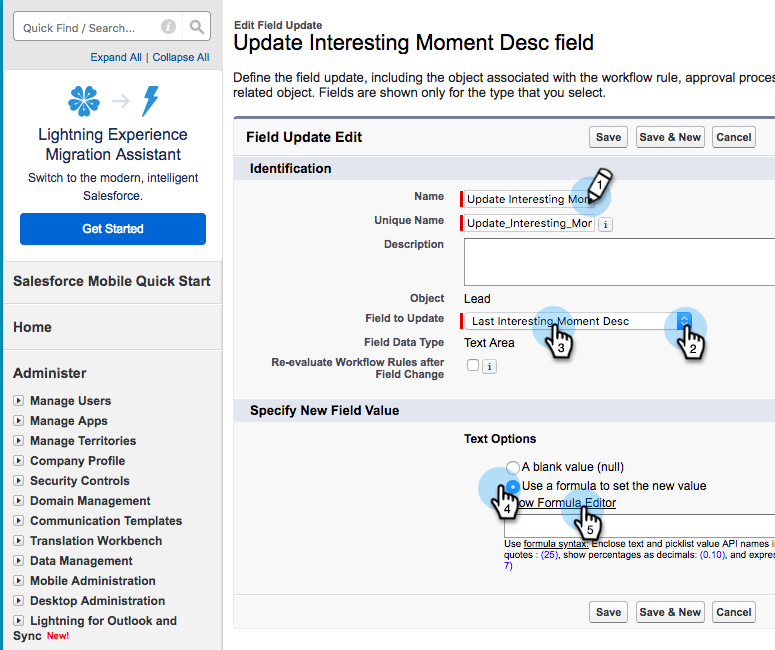

# Creating Workflow Rules in Salesforce {#creating-workflow-rules-in-salesforce}

When using Marketo Sales Insight (MSI) and Marketo Sales Connect (MSC) in parallel, the MSI Best Bets feature in [!DNL Salesforce] will not get updated. All other MSI features work as usual (viewing interesting moments in the iFrame, sending email, adding to campaigns, etc.). This article offers a workaround to get Best Bets working again.

>[!NOTE]
>
>This only impacts customers who are using **both** MSI and MSE, and who want to use the Best Bets feature in MSI. If you don’t need/use Best Bets, you can disregard.

## Getting Started {#getting-started}

The workaround includes creating new workflow rules to copy values from new MSE fields into the old MSI fields. You'll need to create four workflow rules for the Contact object and the same four workflow rules for the Lead object in your own [!DNL Salesforce] instance. This may require you to have CRM Admin rights (depending on your role and setup in the CRM).

Below are the recommended names of the workflow rules and description of each. These apply to the [!UICONTROL Contact] and [!UICONTROL Lead] object:

<table> 
 <colgroup> 
  <col> 
  <col> 
 </colgroup> 
 <tbody> 
  <tr> 
   <td>Update Interesting Moment Desc Field</td> 
   <td>
Copy from: Last Marketo Engagement Desc Copy to: Last Interesting Moment Desc
</td> 
  </tr> 
  <tr> 
   <td>Update Interesting Moment Type field</td> 
   <td>
Copy from: Last Marketo Engagement Type Copy to: Last Interesting Moment Type
</td> 
  </tr> 
  <tr> 
   <td>Update Interesting Moment Source field</td> 
   <td>
Copy from: Last Marketo Engagement Source Copy to: Last Interesting Moment Source
</td> 
  </tr> 
  <tr> 
   <td>Update Interesting Moment Date field</td> 
   <td>
Copy from: Last Marketo Engagement Date Copy to: Last Interesting Moment Date
</td> 
  </tr> 
 </tbody> 
</table>

## Instructions {#instructions}

1. After clicking **[!UICONTROL Setup]**, search for  **Workflow** and select **[!UICONTROL Workflow Rules]**.

   

1. Select **[!UICONTROL New Rule]**.

   

1. Click the [!UICONTROL Object] drop-down and select **[!UICONTROL Lead]**, then click **[!UICONTROL Next]**.

   

1. Enter “Update Interesting Moment Desc Field” as the [!UICONTROL Rule Name]. Select the radio button **[!UICONTROL created, and every time it’s edited]**. In the [!UICONTROL Rule Criteria] drop-down select **[!UICONTROL formula evaluates to true]**. Search for and select the ISCHANGED function. Then, highlight the default field value and click **[!UICONTROL Insert Field]**.

   

1. In the “[!UICONTROL Insert Field]” pop-up, choose **[!UICONTROL Last Marketo Engagement Desc]** and click **[!UICONTROL Insert]**.

   

1. Click **[!UICONTROL Save & Next]**.

   

1. In the [!UICONTROL Add Workflow Action] drop-down, select **[!UICONTROL New Field Update]**.

   

1. In the [!UICONTROL Name] field, enter “Update Interesting Moment Desc Field” ([!UICONTROL Unique Name] will auto-generate). In the [!UICONTROL Field to Update] drop-down, choose **[!UICONTROL Last Interesting Moment Desc]**. Select the **[!UICONTROL Use a formula to set new value]** radio button, then click **[!UICONTROL Show Formula Editor]**.

   

1. Click the **[!UICONTROL Insert Field]** button.

   

1. Select **[!UICONTROL Last Marketo Engagement Desc]**, and click **[!UICONTROL Insert]**. On the next page, click **[!UICONTROL Save]**.

   

1. Click **[!UICONTROL Done]**.

   

1. Click **[!UICONTROL Activate]** to turn on the workflow rule.

   

   After the last step, you can choose to clone the workflow rule for the other fields listed in the [!UICONTROL Getting Started] section: Desc, Type, Source, Date. After you complete the four workflow rules in the [!UICONTROL Contact] object, repeat the same for the [!UICONTROL Lead] object.
