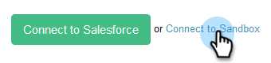

# How to Connect Sales Connect to Your Salesforce Sandbox {#how-to-connect-sales-connect-to-your-salesforce-sandbox}

>[!PREREQUISITES]
>
>Your [!DNL  Sales Connect] account cannot already be connected to [!DNL Salesforce] when establishing a connection to the sandbox. If it is, [make sure you disconnect](/help/marketo/product-docs/marketo-sales-connect/crm/salesforce-integration/disconnect-salesforce-from-your-sales-connect-account.md) before following the steps in this article.

1. In [!DNL Sales Connect], click the gear icon on the upper-right and select **[!UICONTROL Settings]**.

   

1. Under [!UICONTROL Integrations], click **[!UICONTROL CRM]**.

   

1. In the [!DNL Salesforce] card, click **[!UICONTROL More Info]**.

   

1. At the bottom of the page, click **[!UICONTROL Connect to Sandbox]**.

   

   >[!NOTE]
   >
   >If you are already logged in to your [!DNL Salesforce Sandbox] account, you will be taken to an Authorization page where you'll need to allow access. If you're not already logged in, proceed to Step 5.

1. Enter your [!DNL Salesforce Sandbox] account's username and password.

   

>[!MORELIKETHIS]
>
>[How to Install Customizations in Your Salesforce Sandbox](/help/marketo/product-docs/marketo-sales-connect/crm/salesforce-customization/how-to-install-customizations-in-your-salesforce-sandbox.md)
