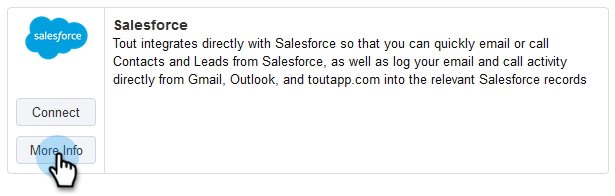

# How to Connect Sales Connect to Your Salesforce Sandbox {#how-to-connect-sales-connect-to-your-salesforce-sandbox}

>[!PREREQUISITES]
>
>Your Sales Connect account cannot already be connected to Salesforce when establishing a connection to the sandbox. If it is, [make sure you disconnect](http://docs.marketo.com/x/FoDq) before following the steps in this article.

1. In Sales Connect, click the gear icon on the upper-right and select **Settings**.

   

1. Under Integrations, click **CRM**.

   

1. In the Salesforce card, click **More Info**.

   

1. At the bottom of the page, click **Connect to Sandbox**.

   

   >[!NOTE]
   >
   >If you are already logged in to your Salesforce Sandbox account, you will be taken to an Authorization page where you'll need to allow access. If you're not already logged in, proceed to Step 5.

1. Enter your Salesforce Sandbox account's username and password.

   

>[!NOTE]
>
>**Related Articles**
>
>[How to Install Customizations in Your Salesforce Sandbox](http://docs.marketo.com/x/EIDq)

