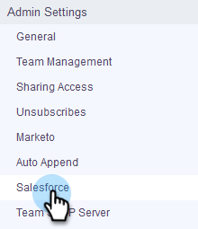
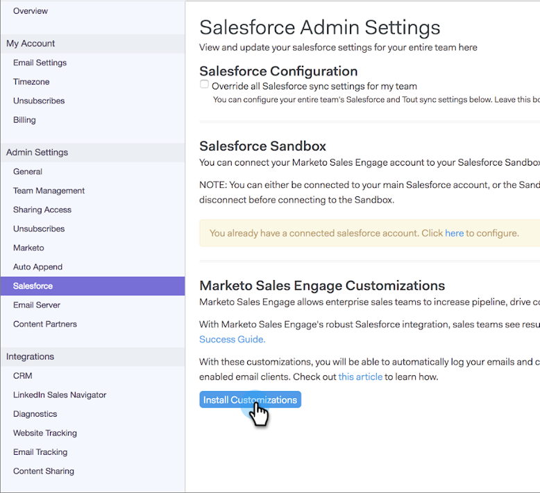

# How to Install Customizations in Your Salesforce Sandbox {#how-to-install-customizations-in-your-salesforce-sandbox}

>[!NOTE]
>
>**Admin Permissions Required**

>[!PREREQUISITES]
>
>[Connect Sales Connect to Your Salesforce Sandbox](/help/marketo/product-docs/marketo-sales-connect/crm/salesforce-customization/how-to-connect-sales-connect-to-your-salesforce-sandbox.md)

1. In Sales Connect, click the gear icon on the upper-right and select **Settings**.

   

1. Under Admin Settings click **Salesforce.**

   

1. Click **Install Customizations**.

   

   Next, simply go through the steps of installing the customization as you would on a regular Salesforce account.
