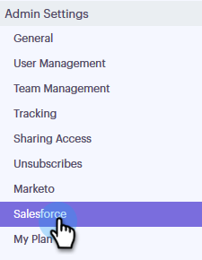
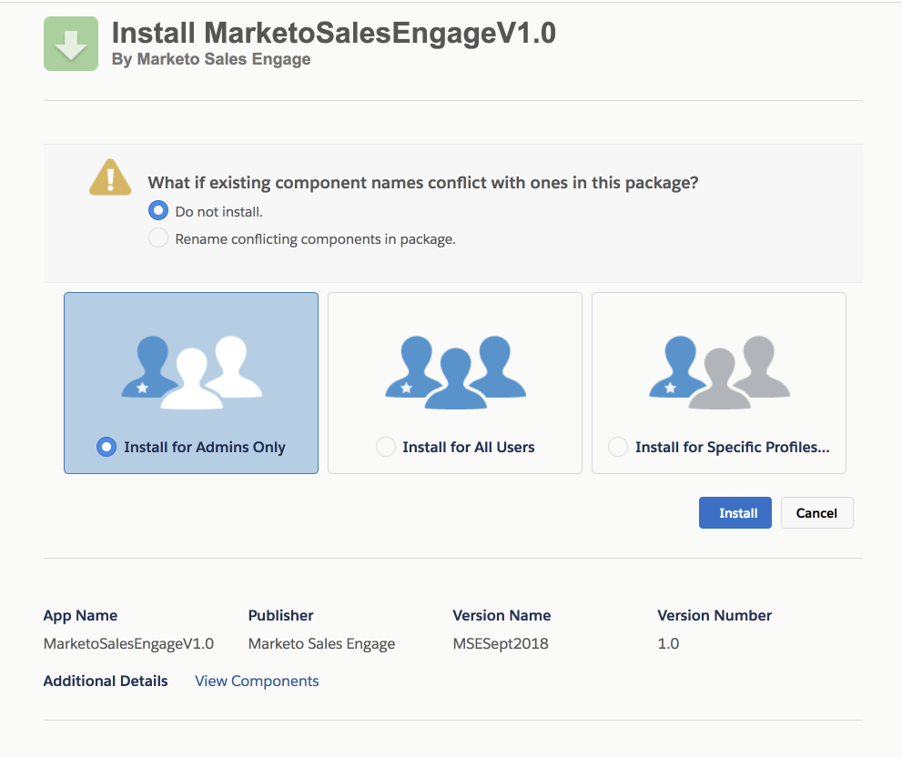

# Install Salesforce Customization for Professional Edition Customers {#install-salesforce-customization-for-professional-edition-customers}

Customers with [!DNL Salesforce] Professional Edition will have to follow these steps to install customization.

>[!PREREQUISITES]
>
>* [!DNL Sales Connect] Admin needs to connect their [!DNL Salesforce] and [!DNL Sales Connect] accounts.
>* [!DNL Salesforce] Instance used needs to have space to install thirteen Custom Activity Fields.

## Installation {#installation}

1. In [!DNL Sales Connect], click the gear icon on the upper-right and select **[!UICONTROL Settings]**.

   

1. Under [!UICONTROL Admin Settings], click **[!UICONTROL Salesforce]**.

   

1. Verify you are connected to your [!DNL Salesforce] account.

   >[!CAUTION]
   >
   >If you are connected, you'll see a green "[!UICONTROL Install]" button. **DO NOT** click this button, proceed to step 4 instead.

1. Log in to the [!DNL Salesforce] account you are connected to and then click [this link](https://login.salesforce.com/packaging/installPackage.apexp?p0=04t0b000001oWEZ).
1. You'll be sent to the [!DNL Sales Connect] Installation page.

   

1. Choose the users you would like to install customizations for: Admin only, all users, or specific profiles.
1. Click on the **[!UICONTROL Install]** button to install customization.
1. To confirm successful installation, log-in to your [!DNL Salesforce] account.
1. Click **[!UICONTROL Setup]**, search for "Installed Packages" in the search bar, and click **[!UICONTROL Installed Packages]**.

   You will see Marketo Sales Connect Customizations there.  
  
   In order to configure [!DNL Sales Connect] in your [!DNL Salesforce] instance, please follow the steps starting from "CONFIGURING THE SALES ENGAGE SALESFORCE PACKAGE" section on page 7 of the Installation Guide.

   >[!NOTE]
   >
   >[!DNL Sales Engage] is the previous name for [!DNL Sales Connect].

## Guides {#guides}

   [Installation Guide for Salesforce Classic](https://s3.amazonaws.com/tout-user-store/salesforce/assets/Marketo+Sales+Engage+For+Salesforce_+Installation+and+Success+Guide.pdf)  
  
   [Installation Guide for Salesforce Lightning](https://s3.amazonaws.com/tout-user-store/salesforce/assets/SF+Guide+for+Lightning.pdf)
