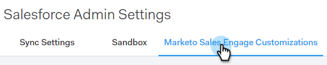
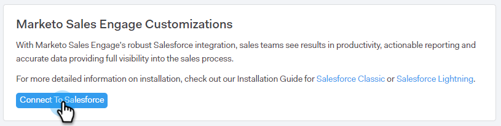
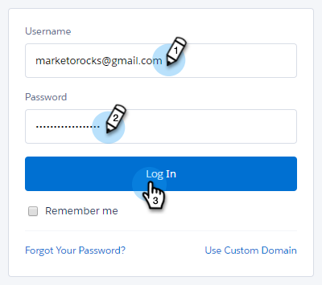
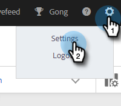
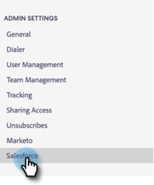
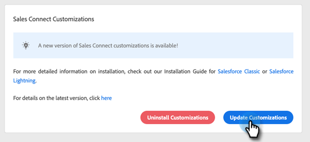
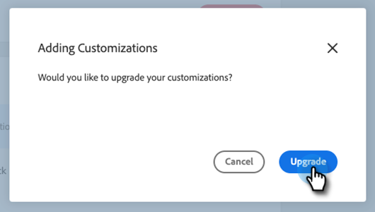
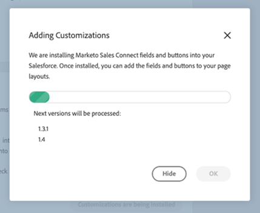
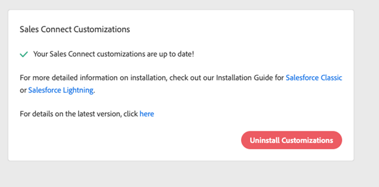

# [!DNL Sales Connect] Customizations for CRM {#sales-connect-customizations-for-crm}

The fields and buttons below are created by the Metadata API in Salesforce CRM. Once the fields are created, admins must configure the page layouts in their CRM to expose them. Instructions [can be found here](/help/marketo/product-docs/marketo-sales-connect/crm/salesforce-customization/assets/mse-for-sf-classic.pdf).

## How to Install Customizations in [!DNL Salesforce] {#how-to-install-customizations-in-salesforce}

1. In [!DNL Sales Connect], click the gear icon and select **[!UICONTROL Settings]**.

   

1. Under [!UICONTROL Admin Settings], select **[!UICONTROL Salesforce]**.

   

1. Click **[!UICONTROL Marketo Sales Engage Customizations]**.

   

1. Click **[!UICONTROL Connect to Salesforce]**.

   

1. Log-in to [!DNL Salesforce].

   

## Update [!DNL Salesforce] Customization {#update-salesforce-customization}

Updates to the [!DNL Salesforce] Customization package will include enhancements and bug fixes. To check if updates are available or to perform an update, follow the steps below.

>[!NOTE]
>
>**Admin permissions required.**

1. In the [web application](https://www.toutapp.com), click the gear icon and select **[!UICONTROL Settings]**.

   

1. Under [!UICONTROL Admin Settings], click **[!UICONTROL Salesforce]**.

   

1. The [!DNL Sales Connect] Customization card will show if updates are available. Click **[!UICONTROL Update Customizations]**.

   

1. Click **[!UICONTROL Upgrade]**.

   

1. Wait for the updates to install. Depending on how many version numbers you need, the install time will vary.

   

Once completed, your card will show "Your Sales Connect customizations are up to date."

   

## Custom Activity Fields {#custom-activity-fields}

Marketo will detect the creation of the new fields then do a one-time backfill of data, a re-mapping, and an ongoing sync of values into the **new** fields only. Old fields will not be updated.

<table><thead>
  <tr>
    <th>Field Name</th>
    <th>Description</th>
  </tr></thead>
<tbody>
  <tr>
    <td>MSE Call Local Presence ID</td>
    <td>As a user you can choose Local Presence as an option when you make calls from the MSE Phone. Incoming calls will show a local number for the receiver.</td>
  </tr>
  <tr>
    <td>MSE Call Recording URL</td>
    <td>Calls can be recorded and a link for the recording will be logged here.</td>
  </tr>
  <tr>
    <td>MSE Campaign</td>
    <td>Logs name of the MSE campaign the Contact/Lead is a member of.</td>
  </tr>
  <tr>
    <td>MSE Campaign URL</td>
    <td>Logs URL to the campaign that was created in MSE. Clicking on this will open the campaign in the MSE web app.</td>
  </tr>
  <tr>
    <td>MSE Campaign Current Step</td>
    <td>If a contact/lead is part of a campaign, this field will log the name of the step the lead/contact is currently on.</td>
  </tr>
  <tr>
    <td>MSE Email Attachment Viewed</td>
    <td>Logs data when an email is sent with an attachment and the attachment is viewed by the recipient.</td>
  </tr>
  <tr>
    <td>MSE Email Clicked</td>
    <td>Logs a checkmark when the recipient clicks a link in an email.</td>
  </tr>
  <tr>
    <td>MSE Email Replied</td>
    <td>Logs a checkmark when the recipient replies to an email.</td>
  </tr>
  <tr>
    <td>MSE Email Status</td>
    <td>Shows if an email is sent/in progress/bounced (tracking bounced emails depends on the delivery channel used).</td>
  </tr>
  <tr>
    <td>MSE Email Template</td>
    <td>Logs name of the MSE template that was used in the email sent to the lead/contact.</td>
  </tr>
  <tr>
    <td>MSE Email Template URL</td>
    <td>Logs URL to the template that was created in MSE. Clicking on this will open the template in the MSE web app.</td>
  </tr>
  <tr>
    <td>MSE Email URL</td>
    <td>Clicking on this URL will open Command Center in MSE and pull up the People Detail View history tab where you can see the sent email.</td>
  </tr>
  <tr>
    <td>MSE Email Viewed</td>
    <td>Logs a checkmark when the recipient views an email.</td>
  </tr>
</tbody></table>

## Roll-Up Logging Fields {#roll-up-logging-fields}

<table><thead>
  <tr>
    <th>Field Name</th>
    <th>Description</th>
  </tr></thead>
<tbody>
  <tr>
    <td>MSE - Last Marketing Engagement</td>
    <td>Last incoming engagement from Marketing.</td>
  </tr>
  <tr>
    <td>MSE - Last Marketing Engagement Date</td>
    <td>Time stamp of engagement from Marketing.</td>
  </tr>
  <tr>
    <td>MSE - Last Marketing Engagement Desc</td>
    <td>Description of the engagement.</td>
  </tr>
  <tr>
    <td>MSE - Last Marketing Engagement Source</td>
    <td>Source of Marketing engagement.</td>
  </tr>
  <tr>
    <td>MSE - Last Marketing Engagement Type</td>
    <td>Type of Engagement.</td>
  </tr>
  <tr>
    <td>MSE - Last Activity by Sales</td>
    <td>Last outgoing activity performed by the Sales team.</td>
  </tr>
  <tr>
    <td>MSE - Last Replied</td>
    <td>Last email reply to Sales email.</td>
  </tr>
  <tr>
    <td>MSE - Current Sales Campaign</td>
    <td>Logs name of the MSE campaign the lead/contact is a member of.</td>
  </tr>
  <tr>
    <td>MSE - Last Sales Engagement</td>
    <td>Last incoming engagement from Sales.</td>
  </tr>
  <tr>
    <td>MSE - Opt Out</td>
    <td>Opt-out field.</td>
  </tr>
</tbody></table>

## Buttons {#buttons}

<table><thead>
  <tr>
    <th>Button Name</th>
    <th>Description</th>
  </tr></thead>
<tbody>
  <tr>
    <td>Send MSE Email</td>
    <td>Send Sales emails from Salesforce.</td>
  </tr>
  <tr>
    <td>Add to MSE Campaign</td>
    <td>Add to MSE campaigns from Salesforce.</td>
  </tr>
  <tr>
    <td>Push to MSE</td>
    <td>Push contact from Salesforce to MSE.</td>
  </tr>
  <tr>
    <td>Call with MSE</td>
    <td>Make Sales calls from Salesforce.</td>
  </tr>
</tbody>
</table>

## Bulk Action Buttons {#bulk-action-buttons}

<table><thead>
  <tr>
    <th>Button Name</th>
    <th>Description</th>
  </tr></thead>
<tbody>
  <tr>
    <td>Add to MSE Campaign</td>
    <td>Add to MSE campaigns from Salesforce.</td>
  </tr>
  <tr>
    <td>Push to MSE</td>
    <td>Push contact from Salesforce to MSE.</td>
  </tr>
</tbody>
</table>

## User Guides {#user-guides}

[MSE Custom Reports in Salesforce](/help/marketo/product-docs/marketo-sales-connect/crm/salesforce-customization/assets/reports-and-dashboards.pdf)

[MSE for Salesforce Classic](/help/marketo/product-docs/marketo-sales-connect/crm/salesforce-customization/assets/mse-for-sf-classic.pdf)

[MSE for Salesforce Lightning](/help/marketo/product-docs/marketo-sales-connect/crm/salesforce-customization/assets/sfdc-guide-lightning.pdf)
