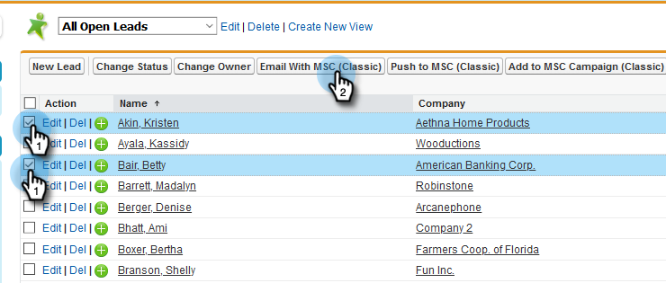
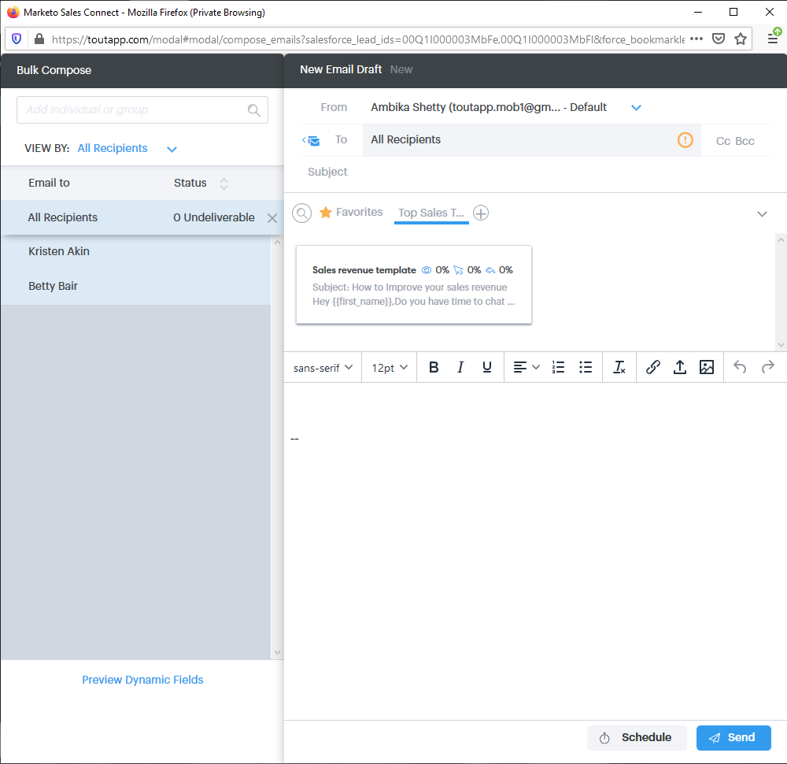
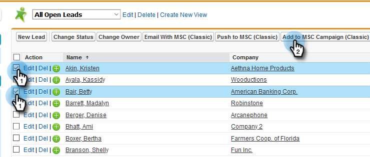
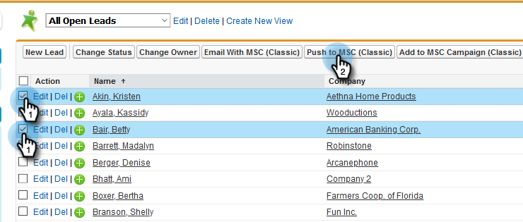
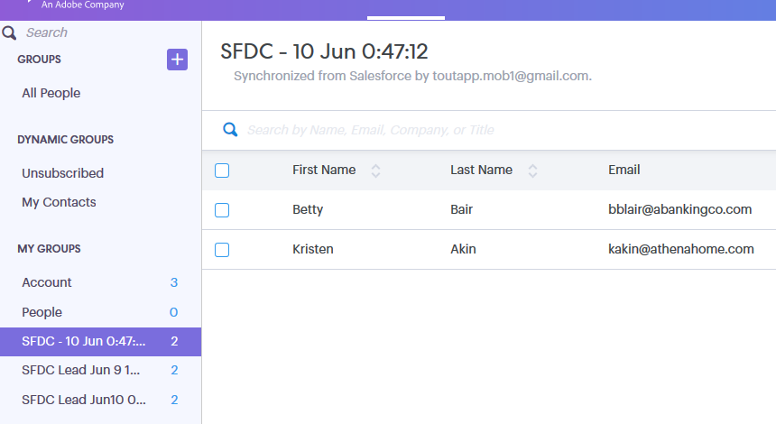

# Using Bulk Actions in [!DNL Salesforce] Classic {#using-bulk-actions-in-salesforce-classic}

Learn how to perform bulk actions, like adding leads to a campaign, send a bulk email, or pushing leads from [!DNL Salesforce] to [!DNL Sales Connect].

>[!PREREQUISITES]
>
>Update to the latest version of the [!DNL Sales Connect] package and install the bulk action buttons in your lead/contact view. [Click here for instructions](https://s3.amazonaws.com/tout-user-store/salesforce/assets/Marketo+Sales+Engage+For+Salesforce_+Installation+and+Success+Guide.pdf).

>[!NOTE]
>
>Before following the steps outlined, make sure you're logged in to your Marketo Sales Connect account.

## Bulk Email {#bulk-email}

1. In [!DNL Salesforce], click the **[!UICONTROL Leads]** tab, then the **[!UICONTROL Go]** button.

   

1. Choose the desired leads and click the **[!UICONTROL Email with MSC (Classic)]** button.

   

1. An MSC email will pop up. It includes the following features:

   a. “[!UICONTROL To]” field shows “[!UICONTROL All Recipients]” - this corresponds to the list of leads you have chosen in the Lead List View  
   b. This list is visible on the left panel called “[!UICONTROL Bulk Compose]” - you can add/remove recipients here  
   c. You can choose a template or create your own email  
   d. You can preview dynamic fields that will be populated in your email  
   e. You can send the email right away or schedule to send it at a later time

   

## Add to Campaign {#add-to-campaign}

1. In [!DNL Salesforce], click the **[!UICONTROL Leads]** tab, then the **[!UICONTROL Go** button.

   

1. Choose the desired leads and click the **[!UICONTROL Add to MSC Campaign (Classic)]** button.

   

1. An "[!UICONTROL Add People to Your Campaign]" pop-up will appear. Click **[!UICONTROL Next]** and go through the typical campaign flow to trigger an MSC campaign.

   

## Push to Marketo Sales Connect {#push-to-marketo-sales-connect}

1. In [!DNL Salesforce], click the **[!UICONTROL Leads]** tab, then the **[!UICONTROL Go]** button.

   

1. Choose the desired leads and click the **[!UICONTROL Push to MSC (Classic)]** button.

   

1. A new tab called “[!UICONTROL Salesforce Bridge]” will open. Click the **[!UICONTROL Proceed to Group →]** button.

   

1. You will be sent to your MSC account where you'll see a group created with date/time stamp. You'll receive a notification once the sync is complete and the group will include the leads synced from [!DNL Salesforce].

   

>[!NOTE]
>
>You can follow the same steps to use bulk actions in Contact List View as well.

>[!MORELIKETHIS]
>
>* [Sending Emails via Group Email](/help/marketo/product-docs/marketo-sales-connect/email/using-the-compose-window/sending-emails-via-group-email.md)
>* [Composing Bulk Emails with Select and Send](/help/marketo/product-docs/marketo-sales-connect/email/using-the-compose-window/composing-bulk-emails-with-select-and-send.md#sending-emails)
