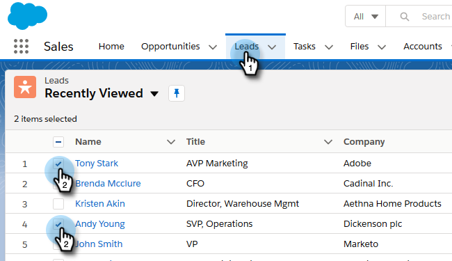
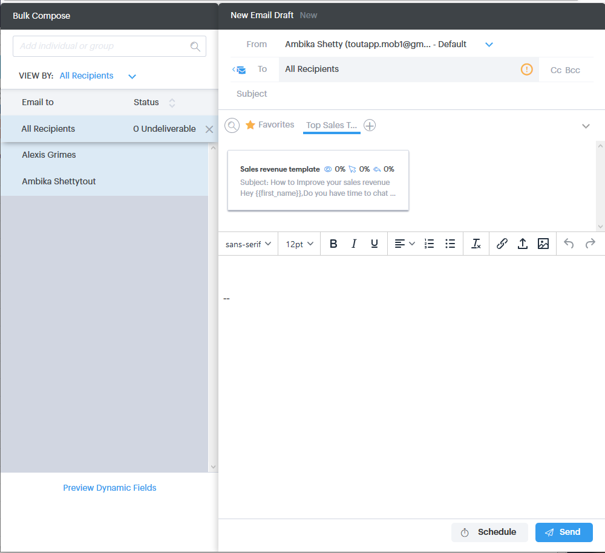
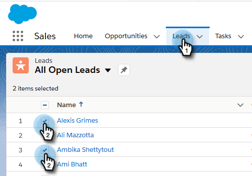
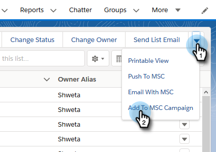
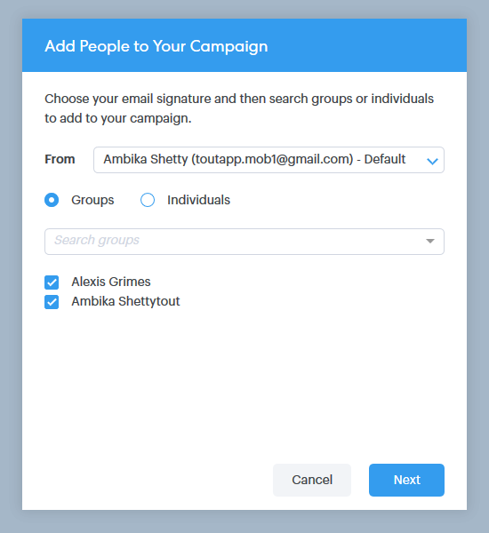
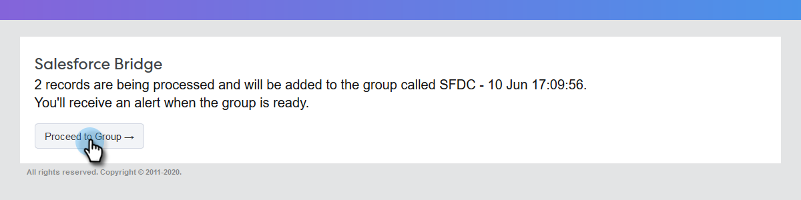

# Using Bulk Actions in [!DNL Salesforce Lightning] {#using-bulk-actions-in-salesforce-lightning}

Learn how to perform bulk actions, like adding leads to a campaign, send a bulk email, or pushing leads from [!DNL Salesforce] to [!DNL Sales Connect].

>[!PREREQUISITES]
>
>Update to the latest version of the [!DNL Sales Connect] package and install the bulk action buttons in your lead/contact view. [Click here for instructions](https://s3.amazonaws.com/tout-user-store/salesforce/assets/SF+Guide+for+Lightning.pdf).

>[!NOTE]
>
>Before following the steps below, make sure you're logged in to your [!DNL Marketo Sales Connect] account.

## Bulk Email {#bulk-email}

1. In [!DNL Salesforce], click the **[!UICONTROL Leads]** tab, then choose the list of desired leads.

   

   >[!NOTE]
   >
   >If you're already on the list you'll be using, you'll have to execute it again by choosing it from the drop-down in order to make sure the MSC bulk action buttons show up. This is [!DNL Salesforce] behavior that cannot be changed.

1. Click the arrow drop-down (on the far right of the screen) and select **[!UICONTROL Email with MSC]**.

   

1. An MSC email will pop up. It includes the following features:

   a. “[!UICONTROL To]” field shows “All receipts” - this corresponds to the list of leads you have chosen in the Lead List View  
   b. This list is visible on the left panel called “Bulk compose” - you can add/remove recipients here  
   c. You can choose a template or create your own email  
   d. You can send the email right away or schedule to send it at a later time

   

## Add to Campaign {#add-to-campaign}

1. In [!DNL Salesforce], click the **[!UICONTROL Leads]** tab, then choose the list of desired leads.

   

1. Click the arrow drop-down (on the far right of the screen) and select **[!UICONTROL Add to MSC Campaign]**.

   

1. An "[!UICONTROL Add People to Your Campaign]" pop-up will appear. Click **[!UICONTROL Next]** and go through the typical campaign flow to trigger an MSC campaign.

   

## Push to [!DNL Marketo Sales Connect] {#push-to-marketo-sales-connect}

1. In [!DNL Salesforce], click the **[!UICONTROL Leads]** tab, then choose the list of desired leads.

   

1. Click the arrow drop-down (on the far right of the screen) and select **[!UICONTROL Push to MSC]**.

   

1. A new tab called “[!DNL Salesforce] Bridge” will open. Click the **[!UICONTROL Proceed to Group] →** button.

   

1. You will be sent to your MSC account where you'll see a group created with date/time stamp. You'll receive a notification once the sync is complete and the group will include the leads synced from [!DNL Salesforce].

   

>[!NOTE]
>
>You can follow the same steps to use bulk actions in Contact List View as well.

>[!MORELIKETHIS]
>
>* [Sending Emails via Group Email](/help/marketo/product-docs/marketo-sales-connect/email/using-the-compose-window/sending-emails-via-group-email.md)
>* [Composing Bulk Emails with Select and Send](/help/marketo/product-docs/marketo-sales-connect/email/using-the-compose-window/composing-bulk-emails-with-select-and-send.md#sending-emails)
