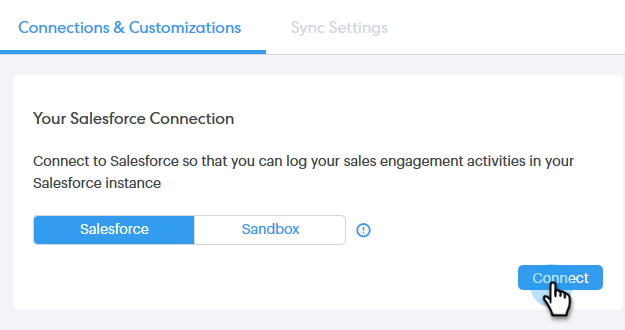
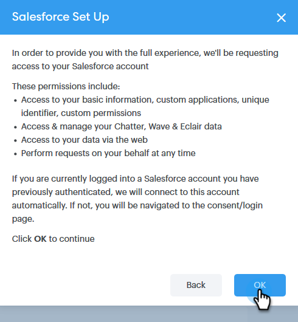

# Connect Your Sales Connect Account to Salesforce {#connect-your-sales-connect-account-to-salesforce}

Follow these simple steps to connect Sales Connect to Salesforce.

## How to Connect as an Admin {#how-to-connect-as-an-admin}

1. In Sales Connect, click the gear icon on the upper-right and select **Settings**.

   

1. Under Admin Settings, click **Salesforce**.

   

1. In the Connections & Customizations tab, click **Connect**.

   

1. Click **OK**.

   

1. If you’re already logged in to Salesforce, you'll be connected. If you're not, you’ll be asked to log-in.

## How to Connect as a non-Admin {#how-to-connect-as-a-non-admin}

1. In Sales Connect, click the gear icon and select **Settings**.

   

1. Under My Account, select **Salesforce**.

   

1. In the Connections & Customizations tab, click **Connect**.

   

1. Click **OK**.

   

1. If you’re already logged in to Salesforce, you'll be connected. If you're not, you’ll be asked to log-in.

