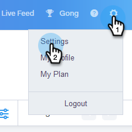

# Disconnect Salesforce From Your Sales Connect Account {#disconnect-salesforce-from-your-sales-connect-account}

Sometimes you may need to disconnect your [!DNL  Salesforce] account from your [!DNL Sales Connect] account. Here's how.

## How to Disconnect From Salesforce as an Admin {#how-to-disconnect-from-salesforce-as-an-admin}

1. In [!DNL Sales Connect], click the gear icon on the upper-right and select **[!UICONTROL Settings]**.

   

1. Under [!UICONTROL  Admin Settings], click **[!UICONTROL Salesforce]**.

   

1. In the [!UICONTROL Connections & Customizations] tab, click **[!UICONTROL Disconnect]**.

   

## How to Disconnect From Salesforce as a non-Admin {#how-to-disconnect-from-salesforce-as-a-non-admin}

1. In [!DNL  Sales Connect], click the gear icon on the upper-right and select **[!UICONTROL Settings]**.

   

1. Under [!UICONTROL My Account], select **[!UICONTROL Salesforce]**.

   

1. In the [!UICONTROL Connections & Customizations] tab, click **[!UICONTROL Disconnect]**.

   
