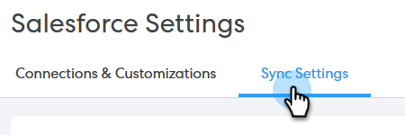
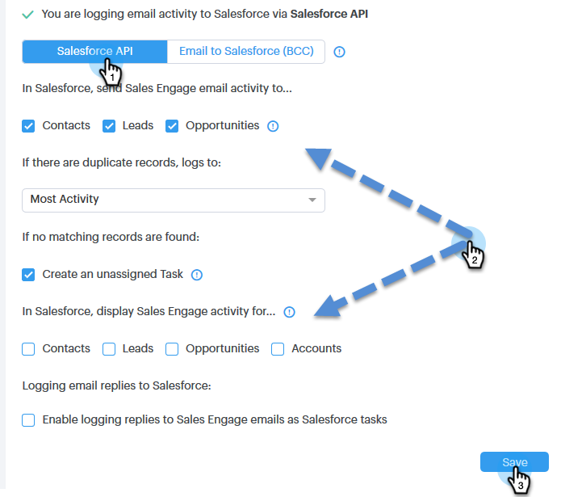
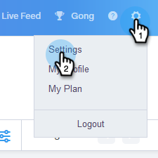
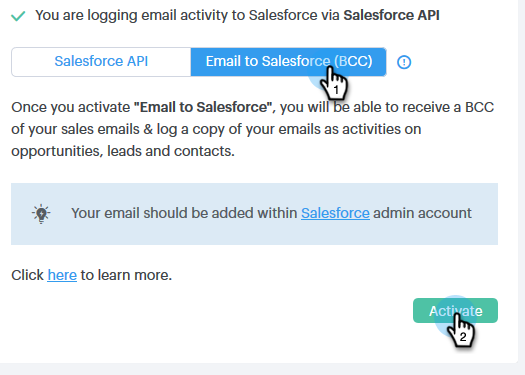
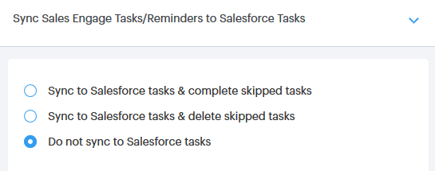

# Salesforce Sync Settings {#salesforce-sync-settings}

## Logging Email Activity to Salesforce via API {#logging-email-activity-to-salesforce-via-api}

This functionality requires you to be on the Enterprise/Unlimited edition of Salesforce, or the Professional edition if you've purchased Integration via Web Services API.

>[!PREREQUISITES]
>
>Salesforce and Sales Connect must be connected.

1. In [!DNL Sales Connect], click the gear icon on the upper-right and select **[!UICONTROL Settings]**.

   

1. Under [!UICONTROL My Account] ([!UICONTROL Admin Settings] if you're an Admin), click **[!UICONTROL Salesforce]**.

   

1. Click the **[!UICONTROL Sync Settings]** tab.

   

1. Click the arrow next to Log Email Activity to [!DNL Salesforce].

   

1. Click the **[!UICONTROL Salesforce API]** tab. In this card you can set up your preference for logging information to [!DNL Salesforce]. Click **[!UICONTROL Save]** when done.

   

## Logging Email Activity to Salesforce via Email to Salesforce (BCC) {#logging-email-activity-to-salesforce-via-email-to-salesforce-bcc}

Once you activate “Email to Salesforce (BCC)”, you'll receive a BCC of your sales emails and your emails will be logged as activities on opportunities, leads and contacts.

>[!PREREQUISITES]
>
>[!DNL Salesforce] and [!DNL Sales Connect] must be connected.

**To log your emails in Salesforce via Email (BCC)**

1. In [!UICONTROL Sales Connect], click the gear icon on the upper-right and select **[!UICONTROL Settings]**.

   

1. Under [!UICONTROL My Account] ([!UICONTROL Admin Settings] if you're an Admin), click **[!UICONTROL Salesforce]**.

   

1. Click the **[!UICONTROL Sync Settings]** tab.

   

1. Click the **[!UICONTROL Email to Salesforce (BCC)]** tab and click **[!UICONTROL Activate]**.

   

If for some reason your Email to [!DNL Salesforce] address does not pull in, follow these steps to activate the BCC feature in your [!DNL Salesforce] account:

1. Log in to your [!DNL Salesforce] instance.
1. Find your user name in the upper-right corner and select the drop-down bar.
1. Select **[!UICONTROL My Settings]**.
1. Select **[!UICONTROL Email]**.
1. Select **[!UICONTROL My Email to Salesforce]**.
1. On this page, you'll see a field labeled "Email to Salesforce Address." If there is nothing populated next to it, scroll down to "My Acceptable Email Addresses."
1. Enter the email address(es) that you want BCC'd.
1. Click **[!UICONTROL Save Changes]**.

**Can't Find My Email to [!DNL Salesforce] in My Settings**

If you don't see My Email to Salesforce under your Settings, your Admin may not have enabled it. This can happen if your team is new to [!DNL Salesforce], or your team has never used the BCC address that [!DNL Salesforce] provides.

>[!NOTE]
>
>You will need Admin privileges to set this up.

1. Click **[!UICONTROL Setup]**.
1. Click **[!UICONTROL Email Administration]**.
1. Click **[!UICONTROL Email to Salesforce]**.
1. Click **[!UICONTROL Edit]**.
1. Check the box next to "[!UICONTROL Active]".
1. Click **[!UICONTROL Save]**.

## Sync Sales Connect Tasks/Reminders to [!DNL Salesforce] Tasks {#sync-sales-connect-tasks-reminders-to-salesforce-tasks}

1. Click the gear icon on the upper-right and select **[!UICONTROL Settings]**.

   

1. Under [!UICONTROL My Account] ([!UICONTROL Admin Settings] if you're an Admin), click **[!UICONTROL Salesforce]**.

   

1. Click the **[!UICONTROL Sync Settings]** tab.

   

1. Click the arrow next to [!UICONTROL Sync Sales Engage Tasks/Reminders to Salesforce Tasks].

   

1. Choose the desired option ("[!UICONTROL Do not sync to Salesforce tasks]" is selected by default).

   
