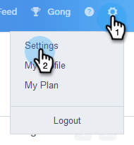
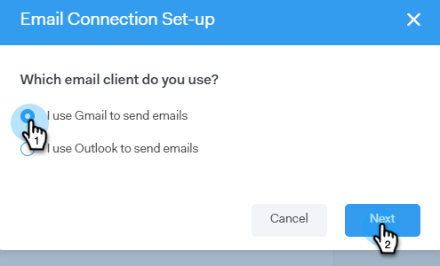
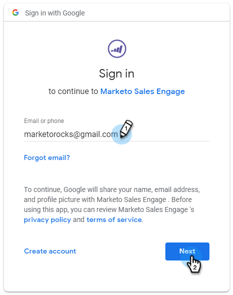
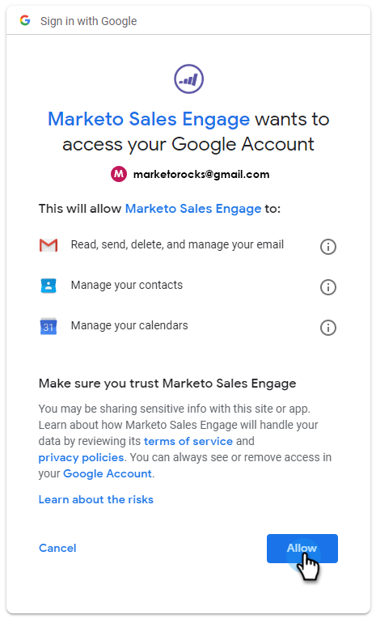

# Email Connection for Gmail Users {#email-connection-for-gmail-users}

Connecting to Gmail means you'll receive reply tracking, access to the Gmail delivery channel, the ability to schedule emails in Gmail, and send compliance.

1. In Sales Connect, click the gear icon and select **Settings**.

   

1. Under My Account, select **Email Settings**.

   

1. Click the **Email Connection** tab.

   

1. Click **Get Started**.

   

1. Select **I use Gmail to send emails** and click **Next**.

   

1. Click **OK**.

   

1. If you've already logged in to Gmail, choose the account you’d like to connect to. If not, enter your Gmail address and click **Next**. In this example, we're not yet logged in.

   

1. Enter your password and click **Next**.

   

1. Click **Allow**.

   

   You can use this connection to track emails and also as a delivery channel.

>[!NOTE]
>
>Gmail enforces its own sending limits. [Learn more here](/help/marketo/product-docs/marketo-sales-connect/email/email-delivery/email-connection-throttling.md#email-provider-limits).
