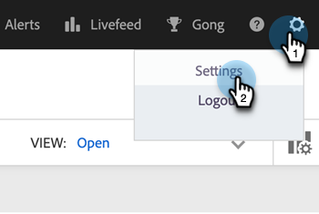
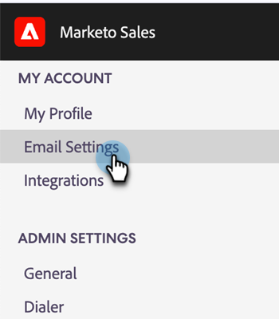
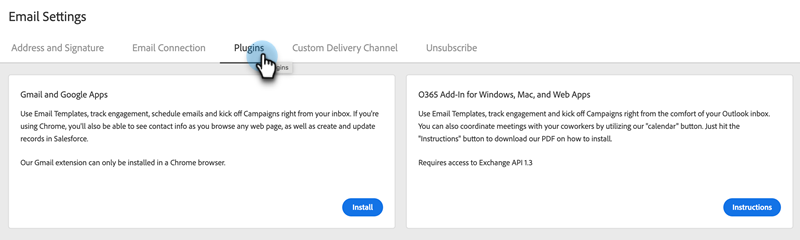
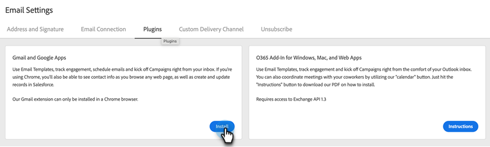

# Install the Sales Connect Email Plugin for Gmail {#install-the-sales-connect-email-plugin-for-gmail}

Learn how to install the Gmail plugin.

>[!IMPORTANT]
>
>The email plugins for Gmail and Outlook are supported for Marketo Sales Connect users only. They are **not** supported for Sales Insight Actions users.

1. In the [web application](https://toutapp.com/next#settings), click the gear icon and click **[!UICONTROL Settings]**.

   

1. Under My Account, click **[!UICONTROL Email Settings]**.

   

1. Click the **[!UICONTROL Plugins]** tab.

   

1. Under Gmail and Google Apps, click **[!UICONTROL Install]**.

   
