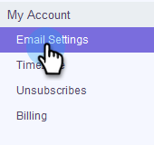
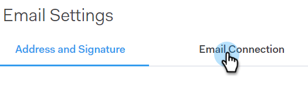
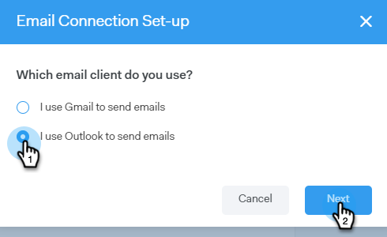
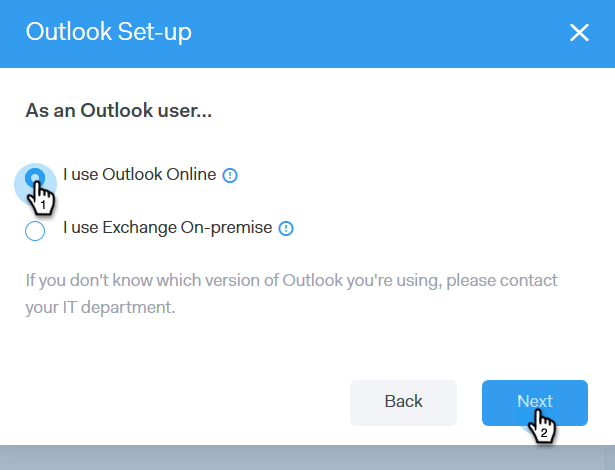
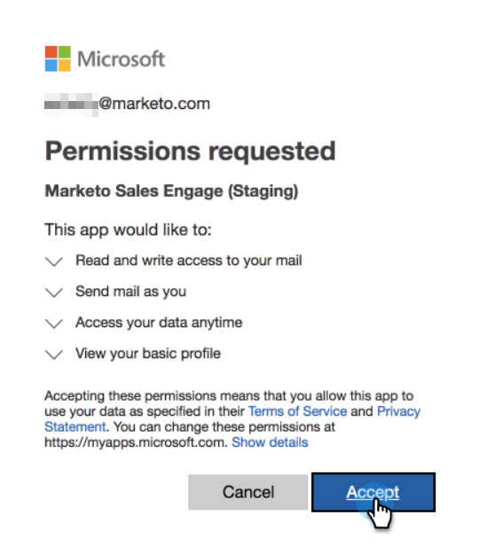
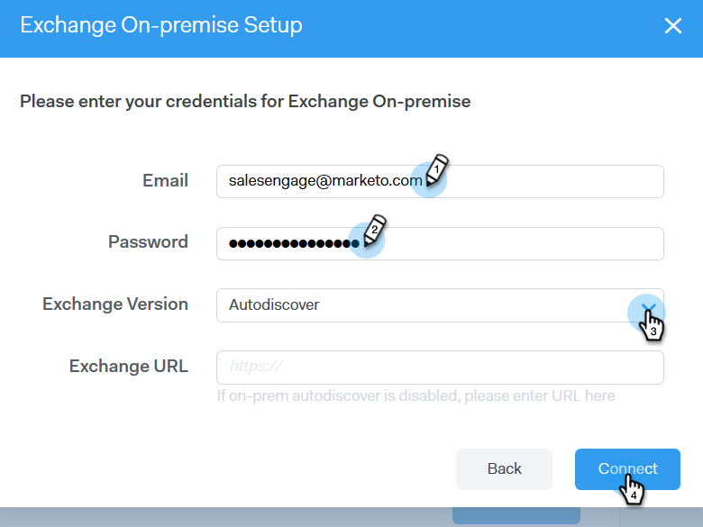

# Email Connection Tab for Outlook Users {#email-connection-tab-for-outlook-users}

Learn how to connect your Sales Connect account with Outlook.

### What's in this article? {#whats-in-this-article}

[Connecting to Outlook Online](#connecting-to-outlook-online)  
[Connecting to Exchange On-Premise](#connecting-to-exchange-on-premise)

>[!NOTE]
>
>Each user needs to connect to Outlook from their Sales Connect account.

#### Connecting to Outlook Online {#connecting-to-outlook-online}

Connecting to Outlook means you'll receive reply tracking, access to the Outlook delivery channel, the ability to schedule emails in Outlook, and send compliance.

1. In Sales Connect, click the gear icon and select **Settings**.

   

1. Under My Account, select **Email Settings**.

   

1. Click the **Email Connection** tab.

   

1. Click **Get Started**.

   

1. Select **I use Outlook to send emails** and click **Next**.

   

1. Select the version of Outlook you're using and click **Next**. In this example we're choosing Outlook Online.

   

   | **Outlook Online** |Also known as Office Online |
   |---|---|
   | **Exchange On-premise** |Includes Exchange 2013 and 2016 |

1. Click **OK**.

   

1. If you're not logged in to Outlook, enter your log-in info and click **Next**. If you are, choose the account you’d like to connect to and click **Next**. In this example, we're already logged in.

   

1. Click **Accept**.

   

   You can use this connection to track emails and also [as a delivery channel](http://docs.marketo.com/display/public/DOCS/Setting+up+Your+Delivery+Channel#SettingupYourDeliveryChannel-Gmail).

   >[!NOTE]
   >
   >When using Outlook as a delivery channel, you cannot send more than 300 bulk emails at a time.

#### Connecting to Exchange On-Premise {#connecting-to-exchange-on-premise}

Connecting to Exchange On-Premise means you'll receive reply tracking, access to the Outlook delivery channel, the ability to schedule emails in Outlook, and send compliance.

1. In Sales Connect, click the gear icon and select **Settings**.

   

1. Under My Account, select **Email Settings**.

   

1. Click the **Email Connection** tab.

   

1. Click **Get Started**.

   

1. Select **I use Outlook to send emails** and click **Next**.

   

1. Select the version of Outlook you're using and click **Next**. In this example we're choosing Exchange On-premise.

   

   | **Outlook Online** |Also known as Office Online |
   |---|---|
   | **Exchange On-premise** |Includes Exchange 2013 and 2016 |

1. Enter your credentials and click **Connect**.

   

   >[!NOTE]
   >
   >If you turn off Autodiscover in the Exchange Version drop-down, you'll need to ask your IT department for the Exchange URL.

   [as a delivery channel](http://docs.marketo.com/display/public/DOCS/Setting+up+Your+Delivery+Channel#SettingupYourDeliveryChannel-Gmail)

   >[!NOTE]
   >
   >When using Outlook as a delivery channel, you cannot send more than 300 bulk emails at a time.

You can use this connection to track emails and also . 