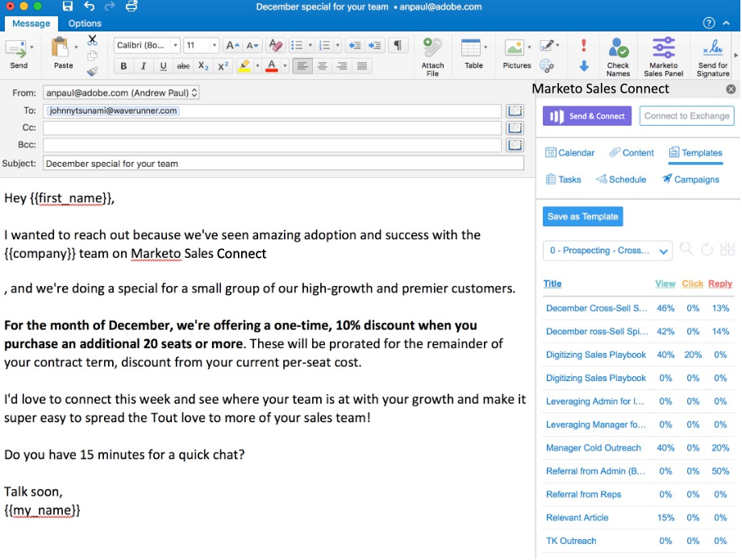

# Installing [!DNL Sales Connect] for [!DNL Office365] Mac OS, [!DNL Windows], and Online {#installing-sales-connect-for-office-mac-os-windows-and-online}

We have created an integration with [!DNL Outlook Web Apps]. [!DNL Outlook Web Apps] is a version of [!DNL Outlook] provided with the [!DNL Office 365] subscription. Since it's browser-based, the integration will work on both Mac and [!DNL Windows]. [Click here for the complete installation guide](https://s3.amazonaws.com/tout-user-store/outlook-mac/assets/install_tout_add-in_outlook_mac.pdf).

As an Admin, you can [install this on behalf of your entire team](https://docs.microsoft.com/en-us/office365/admin/manage/manage-deployment-of-add-ins?view=o365-worldwide).

>[!NOTE]
>
>If you don't have a store button, you're not on the latest version of [!DNL Outlook] for Mac. Follow these steps to get updated:
>
>i. Go to the Help button (in the very top navigation, to the right of “[!DNL Outlook]”)
>
>ii. Choose **[!UICONTROL Check for Updates]** in the drop-down menu
>
>iii. Update to the latest version of [!DNL Outlook] and come back to these steps when you’re done

>[!NOTE]
>
>The .Net add-in no longer supports scheduling emails from [!DNL Outlook]. You'll need to update to the [!DNL Office365] add-in to schedule emails.
