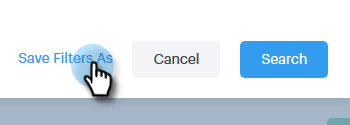

# Advanced Search Overview {#advanced-search-overview}

By utilizing the advanced search to target prospects who have viewed, clicked, or replied to emails, you can create a targeted list of your most engaged prospects.

## How to Access Advanced Search {#how-to-access-advanced-search}

1. Click **Command Center**.

   

1. Click **Emails**.

   

1. Choose your applicable tab.

   

1. Click **Advanced Search**.

   

## Filters {#filters}

**Date**

Choose the date range for your search. Preset dates update depending on the email status you choose (Sent, Undelivered, Pending).

**Who**

Filter by email recipient/sender in the Who section.

| Drop-down | Description |
|---|---|
| **View As** |Filter by a specific sender in your Sales Connect instance (this option is available to Admins only). |
| **By Group** |Filter emails by a specific group of recipients. |
| **By Person** |Filter by a specific recipient. |

**When**

Choose by date created, date delivered, date failed, or date scheduled. Available options change depending on the email status you choose (Sent, Undelivered, Pending).

**Campaigns**

Filter emails by campaign participation.

**Status**

There are three email statuses to choose from. The type/activity options change based on the status selected.

***Status: Sent***

Filters by your sent email activity. You can choose views/no views, clicks/no clicks, and/or replies/no replies.

***Status: Pending***

Filters by all pending emails.

| Status | Description |
|---|---|
| **Scheduled** |Emails that have been scheduled from the compose window (Salesforce or the Web App), email plug-ins, or a campaign. |
| **Drafts** |Emails that are currently in draft state. Emails require a subject line and a recipient in order to be saved as a draft. |
| **In Progress** |Emails that are in the process of being sent. Emails should not remain in this state for more than a few seconds. |

***Status: Undelivered***

Filters by emails that were never delivered.

| Status | Description |
|---|---|
| **Failed** |When an email fails to send from Sales Connect (common reasons include: emails being sent to unsubscribed/blocked contacts, or if there was an issue populating the dynamic fields). |
| **Bounced** |An email is marked as bounced when it is rejected by the recipient's server. Only emails that were sent via Sales Connect servers will be shown here. |
| **Spam** |When the email was marked as spam (common term for unsolicited email) by the recipient. Only emails that were sent via Sales Connect servers will be shown here. |

## Saved Searches {#saved-searches}

Here's how to create a saved search.

1. After all of your filters are in place, click **Save Filters As**.

   

1. Give your search a name and click **Save**.

   

   Your saved searches will be in the sidebar on the left.

   
