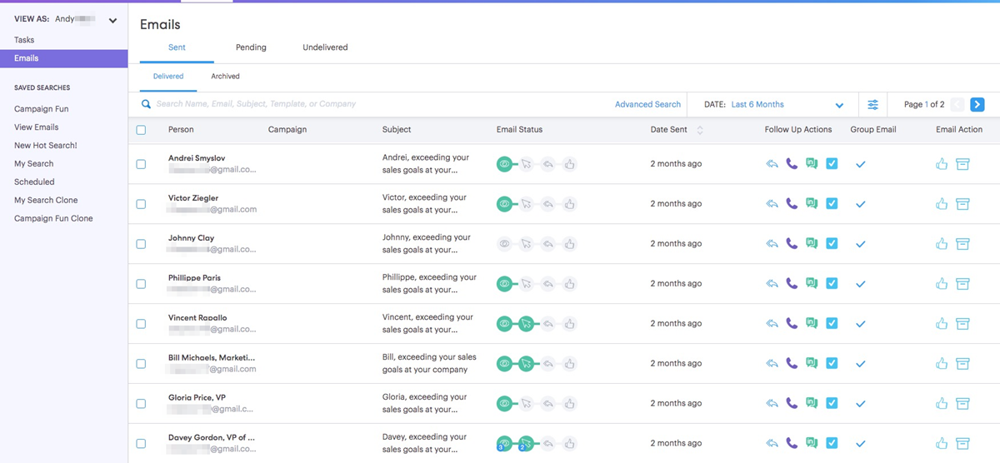
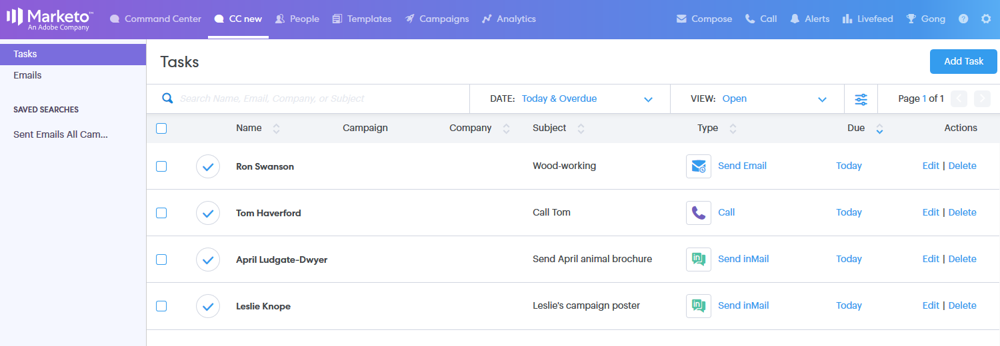

# Command Center Overview {#command-center-overview}

The Commend Center is a single, unified view that helps you figure out your next step, while making sure nothing falls through the cracks.

## Manage Emails {#manage-emails}

The email section of the Command Center is where you can manage all of your email activity. Think of it as your email outbox to review emails that have been sent from Sales Connect. Manage your scheduled emails, see who's been engaging with your emails, check to see if there were any issues with your emails being delivered, and more.

The email section gives you a birds eye view into all of your emails and simplifies their organization with primary tabs and sub-tabs that act as folders where your emails are automatically stored based on their status.

<table> 
 <colgroup> 
  <col> 
  <col> 
  <col> 
 </colgroup> 
 <tbody> 
  <tr> 
   <td title="Background colour : Grey">
<strong>Primary </strong>
</td> 
   <td title="Background colour : Grey">
<strong>Secondary </strong>
</td> 
   <td title="Background colour : Grey">
<strong>Description </strong>
</td> 
  </tr> 
  <tr> 
   <td title="Background colour : Blue"><strong title="">Sent</strong></td> 
   <td title="Background colour : Blue">Delivered</td> 
   <td title="Background colour : Blue">Emails that have been delivered to the recipient.</td> 
  </tr> 
  <tr> 
   <td title="Background colour : Blue"> </td> 
   <td title="Background colour : Blue">Archived</td> 
   <td title="Background colour : Blue">Emails that have been archived by the user in order to disable the tracking on the emails.</td> 
  </tr> 
  <tr> 
   <td title="Background colour : Grey"><strong title="">Pending</strong></td> 
   <td title="Background colour : Grey">Scheduled</td> 
   <td title="Background colour : Grey">Emails that are currently scheduled to go out. Once an email is sent it will be moved to the delivered folder.</td> 
  </tr> 
  <tr> 
   <td title="Background colour : Grey"> </td> 
   <td title="Background colour : Grey">Draft</td> 
   <td title="Background colour : Grey">
Emails that have been saved as a draft. <strong>Note:</strong> Only single emails can be saved as drafts. Bulk emails (Select and Send Emails and Group Emails) will not be saved as drafts.
</td> 
  </tr> 
  <tr> 
   <td title="Background colour : Grey"> </td> 
   <td title="Background colour : Grey">In Progress</td> 
   <td title="Background colour : Grey">This is an in-between state that emails go into when they are in the sending motion. Emails should only be In-Progress for a few moments.</td> 
  </tr> 
  <tr> 
   <td title="Background colour : Blue"><strong title="">Undelivered</strong></td> 
   <td title="Background colour : Blue">Failed</td> 
   <td title="Background colour : Blue">Emails that have failed to deliver.</td> 
  </tr> 
  <tr> 
   <td title="Background colour : Blue"> </td> 
   <td title="Background colour : Blue">Bounced</td> 
   <td title="Background colour : Blue">
Emails that have been rejected from the recipients email server.  <strong>Note:</strong> This is only detected if you are a legacy ToutApp user and have access to MSC Servers as a delivery channel.
</td> 
  </tr> 
  <tr> 
   <td title="Background colour : Blue"> </td> 
   <td title="Background colour : Blue">Spam</td> 
   <td title="Background colour : Blue">
Emails that have been manually been marked as spam by the recipient. <strong>Note:</strong> This is only detected if you are a legacy ToutApp user and have access to MSC Servers as a delivery channel.
</td> 
  </tr> 
 </tbody> 
</table>

## Manage Tasks {#manage-tasks}

The task section is your one-stop shop for managing and completing tasks. Here you can seamlessly manage your tasks to increase your productivity and stay focused on the most relevant items.

## Follow-up with Engaged prospects {#follow-up-with-engaged-prospects}

Once you've started engaging with your prospects via the compose window or campaigns, you can start to re-target the most engaged prospects by utilizing the advanced search functionality.

For example, if you add 100 people to a campaign in MSC, you may want to re-target the people who viewed and clicked your email, but did not reply to it. To do this you can utilize the Campaign filter along with the View and Click status Activity filters to identify a list of people to re-target.

Bonus: If you save your advanced search, it will work as a dynamic list and add emails that meet the engagement criteria once the recipient views or clicks your email.

>[!MORELIKETHIS]
>
>* [Tasks](/help/marketo/product-docs/marketo-sales-connect/tasks/syncing-sales-connect-tasks-with-salesforce-for-the-first-time.md)
>* [Advanced Search Overview](/help/marketo/product-docs/marketo-sales-connect/email/command-center/advanced-search-overview.md)
>* [Composing Bulk Emails with Select and Send](/help/marketo/product-docs/marketo-sales-connect/email/using-the-compose-window/composing-bulk-emails-with-select-and-send.md)
