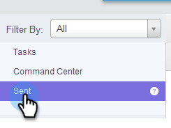
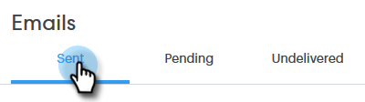
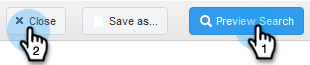
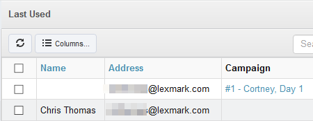

# View Sent Folder as Another User {#view-sent-folder-as-another-user}

As an Admin, you can view the sent folder of any user.

>[!NOTE]
>
>**Admin Permissions Required**

1. In the Command Center, click **Sent**.

   

1. Click the **View Options** button.

   

1. In the **Sent By** box, select the desired user.

   

1. Click **Preview Search**, then **Close**.

   

1. You are now viewing sent emails as the selected user.

   

