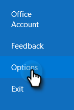
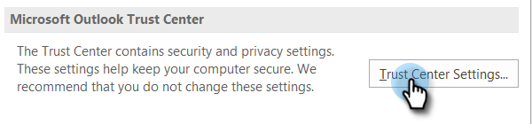
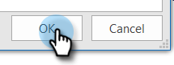

# Preventing Self Views {#preventing-self-views}

## Overview {#overview}

Getting false positives on your view tracking can lead to reporting inconsistencies. This often occurs when users of MSC accidentally invoke the tracking pixel from their email client (we call this a self-view). Below are a few tips on significantly reducing and even eliminating self-views.

## Web ([!DNL Outlook Web App] and Gmail) {#web-outlook-web-app-and-gmail}

[!DNL Sales Connect] will store a cookie in your browser to prevent views from being tracked when opening your emails from Outlook Web App and Gmail. If you are still receiving self-views, we recommend doing the following:

* Ensure that you have cookies enabled on your computer.

* If you're using a new computer or mobile device, make sure you've logged in to the web application. This will allow us to recognize your computer/device going forward.

## Desktop (Windows) {#desktop-windows}

Views are tracked by downloading a small invisible image pixel in your email client. You can significantly lower the amount of self-views in [!DNL Outlook] by disabling images to be automatically downloaded. Below are the steps how.

1. In [!DNL Outlook], click **[!UICONTROL File]** in the menu bar.

   

1. Click **[!UICONTROL Options]**.

   

1. In the [!DNL Outlook] Options dialog box, click **[!UICONTROL Trust Center]**.

   

1. Under [!UICONTROL Microsoft Outlook Trust Center], click **[!UICONTROL Trust Center Settings]**.

   

1. Click [!UICONTROL Automatic Download] in the menu on the left, and select the **[!UICONTROL Don't download pictures automatically in HTML email or RSS items]** check box.

   

1. Click **[!UICONTROL OK]** in the [!UICONTROL Trust Center] dialog box.

   

1. Click **[!UICONTROL OK]** in the [!DNL Outlook] Options dialog box.

   

## Desktop (Mac) {#desktop-mac}

Views are tracked by downloading a small invisible image pixel in your email client. You can significantly lower the amount of self-views in [!DNL Outlook] by disabling images to be automatically downloaded. Below are the steps how.

1. In [!DNL Outlook], click **[!UICONTROL Outlook]** in the menu bar and select **[!UICONTROL Preferences]**.

   

1. Under [!UICONTROL Email], choose **[!UICONTROL Reading]**.

   

1. Under [!UICONTROL Security], click the **[!UICONTROL Never]** radio button.

   
