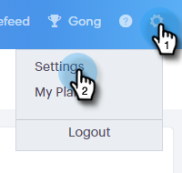
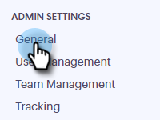
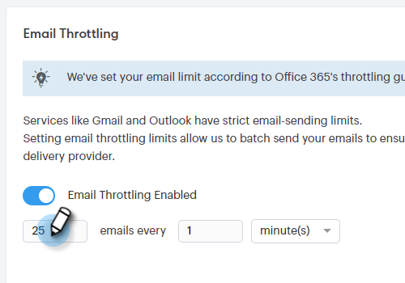
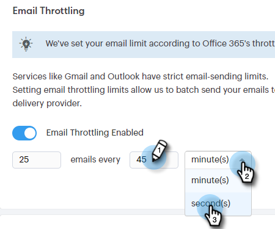
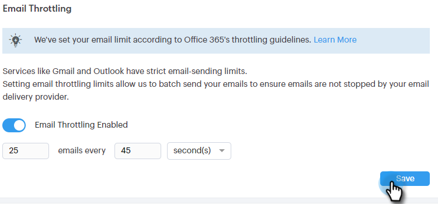

# Email Connection Throttling {#email-connection-throttling}

Integrating your Sales Connect account to send through Exchange or Gmail email providers offers a streamlined setup and optimizes email deliverability for 1:1 sales communication. However, to keep systems healthy and accounts safe, Gmail and Exchange enforce email send limits. These limits are open to be increased or decreased at the providers' discretion.

## Overview {#overview}

Email Connection Throttling allows Sales Connect administrators to configure the send rate of emails when using Gmail or Exchange as your delivery channel, so that the rate at which emails are being handed over to the delivery channel provider do not exceed the enforced limits.

When limits are consistently exceeded this can sometimes be seen as suspicious behavior from the delivery channel provider, causing emails to fail and sometimes even an account to be disabled.

**Notes/Highlights**

* Automatically enabled once a user connects to Gmail or Exchange
* Can be customized if you want to increase or decrease settings from recommendation to meet your needs
* Only throttles emails sent through Gmail or Exchange, does not throttle for custom delivery channel
* The Email Connection throttling queues up each individual users emails separately as each user has their own connection with their email provider

**Configuring your Email Connection Throttling Settings**

1. Click the gear icon and select **Settings**.

   

1. Click **General**.

   

1. In the Email Connection Throttling card, enter the desired batch size of emails that will be sent over to the email channel provider.

   

1. Set the amount of time to wait before each batch is sent. In this example we're choosing 25 emails every 45 seconds.

   

1. Click **Save**.

   

With the changes saved, all users will have their emails sent in batches to their connected Gmail or Exchange account for delivery.

## Email Provider Limits {#email-provider-limits}

**Outlook 365**

Business/Enterprise

* 10,000 per day
* 30 per minute
* 500 recipients per email

More information [can be found here](https://docs.microsoft.com/en-us/office365/servicedescriptions/exchange-online-service-description/exchange-online-limits?redirectedfrom=MSDN#RecipientLimits).

**Gmail**

* 2000 per day (500 for trial and flagged accounts)
* 2 emails per second (API Limit)
* 2,000 recipients per message (maximum of 500 for external recipients)

More information [can be found here](https://support.google.com/a/answer/166852?hl=en).

**Microsoft Exchange Server (2010, 2013)**

Limits are set by the organization's IT department as the server is hosted by the organization. Contact the network or system admin as applicable for additional information.

>[!MORELIKETHIS]
>
>* [Delivery Channel Overview](/help/marketo/product-docs/marketo-sales-connect/email/email-delivery/delivery-channel-overview.md)
>* [Email Connection for Gmail Users](/help/marketo/product-docs/marketo-sales-connect/email-plugins/gmail/email-connection-for-gmail-users.md)
>* [Email Connection for Outlook Users](/help/marketo/product-docs/marketo-sales-connect/email-plugins/msc-for-outlook/email-connection-for-outlook-users.md)
