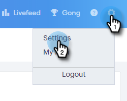
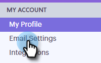
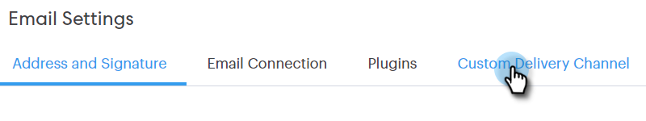
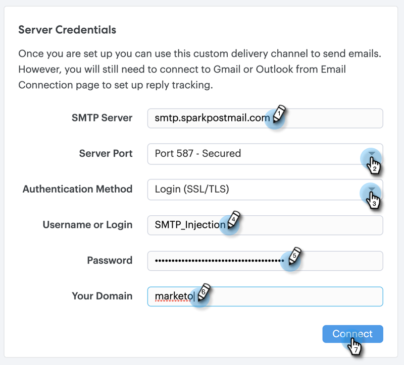
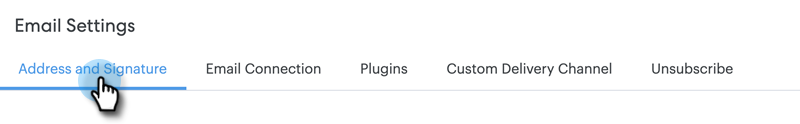
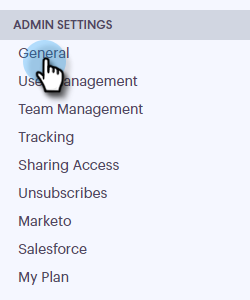
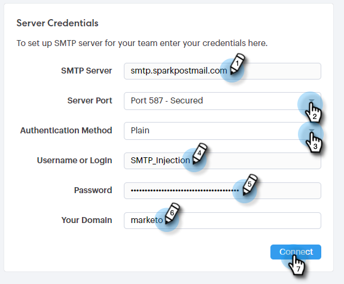

# Setting up a Custom Delivery Channel {#setting-up-a-custom-delivery-channel}

Marketo Sales Connect allows you to integrate with a custom SMTP server for the delivery of your emails. This is a great option for those who don't want to send bulk emails out of their Gmail or Exchange delivery channel.

Users can set up a custom SMTP server for their own individual usage, or Admins can set up a Team SMTP to be shared across all Sales Connect users in your instance.

>[!NOTE]
>
>* In addition to setting up your SMTP server, your [email identity has to be verified](/help/marketo/product-docs/marketo-sales-connect/getting-started/email-settings/verify-your-email.md) before you can send emails.
>* We recommend working with your IT team or SMTP server vendor to get the right server credentials for your SMTP server.
>* You cannot connect your Gmail and Exchange server using the SMTP server credentials. Please use our Email Connection service to integrate with these providers.

## Custom SMTP {#custom-smtp}

1. Log in to the [web application](https://toutapp.com/login), click the gear icon on the top right and choose **Settings**.

   

1. Under My Account, click **Email Settings**.

   

1. Click **Custom Delivery Channel**.

   

1. Enter your SMTP Server credentials and click **Connect**.

   

   >[!NOTE]
   >
   >If this is your only delivery channel, it's automatically assigned to all of your email identities, and you're done here. If this is not your only delivery channel, please continue to Step 5.

1. While still in Email Settings, click **Address and Signature**.

   

1. Find the email identity for which you want to choose a delivery channel and click **Choose Delivery Channel**.

   

1. In the Deliverability Card, click **Edit**.

   

1. Click the Channel drop-down and choose the custom delivery channel you just added. Click **Save**.

   

   >[!NOTE]
   >
   >If your team admin sets up the Team SMTP Server, it will automatically apply only to your default email identity, and be available as an option for your other email identities.

## Team SMTP Server {#team-smtp-server}

   >[!NOTE]
   >
   >**Admin Permissions Required**

1. Log in to the [web application](https://toutapp.com/login), click the gear icon on the top right and choose **Settings**.

   

1. Under Admin Settings, click **General**.

   

1. Click **Team Delivery Channel**.

   

1. Enter your SMTP Server credentials and click **Connect**.

   

   >[!NOTE]
   >
   >The Team SMTP Server will be the default delivery channel of the default email identity for all team members. Additionally, it will be available as a delivery channel option for all other email identities.

   >[!MORELIKETHIS]
   >
   >* [Email Connection for Gmail Users](/help/marketo/product-docs/marketo-sales-connect/email-plugins/gmail/email-connection-for-gmail-users.md)
   >
   >* [Email Connection for Outlook Users](/help/marketo/product-docs/marketo-sales-connect/email-plugins/msc-for-outlook/email-connection-for-outlook-users.md)
