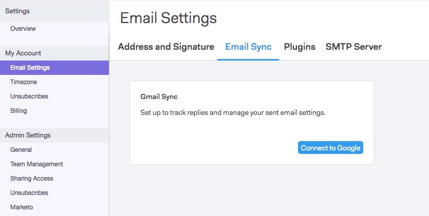
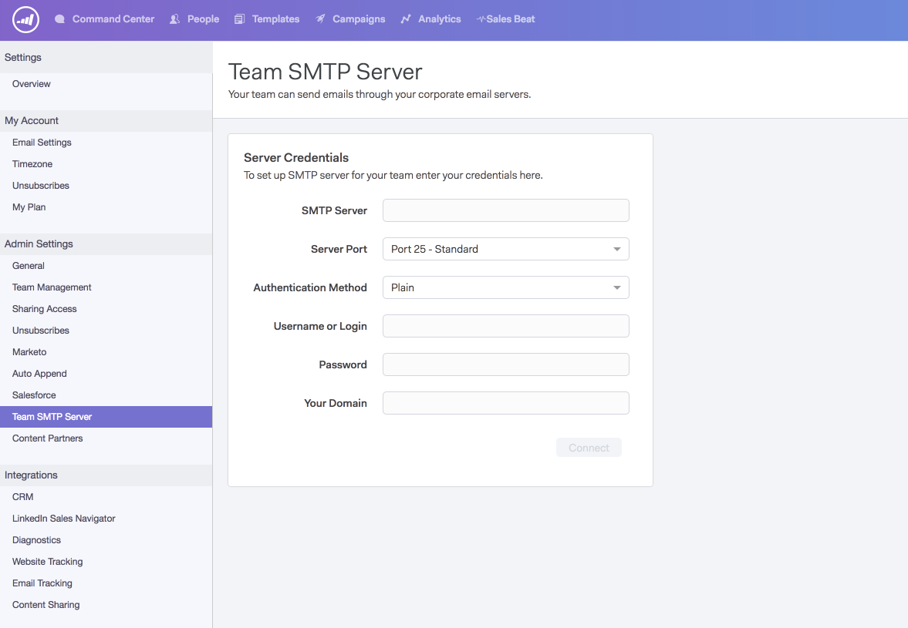

# Setting up an SMTP Server {#setting-up-an-smtp-server}

Setting up an SMTP Server - Marketo Docs - Product Documentation

### What's in this article? {#whats-in-this-article}

[Overview](#overview)  
[Getting the SMTP Credentials](#getting-the-smtp-credentials)

#### Overview {#overview}

**What is an SMTP server?** 
  
**S**imple **M**ail **T**ransfer **P**rotocol, this is the server responsible for sending your outbound mail. When you send an email from your email client, you're using this same service to deliver your email.  
  
**Why do I want to set up my SMTP server with Sales Connect?** 
  
It allows you to utilize the reputation of your company's domain and deliverability, and to not have to rely on others'. Our default MSC Servers are part of a shared IP pool, which means sending from a shared reputation. We highly recommend your team sets up their own delivery channel with Sales Connect.

**How does Sales Connect send with my SMTP server?**

By following [these steps](http://docs.marketo.com/x/ZgPh).

`<pre><em>SMTP Server Setup Page in Sales Connect</em>  </pre>` **Do I need to set anything up in my email client?** 
  
As far as a delivery channel goes, no. Once you've installed our add-in, Sales Connect will leverage the same delivery channel you set up for sending emails.

#### Getting the SMTP Credentials {#getting-the-smtp-credentials}

**How do I get my SMTP credentials?** 
  
Contact your IT team to find out what delivery channel your company is using to send emails and how to get access to your SMTP credentials. Depending on how your server is configured, you may have some custom values for the SMTP Server Name or Server Port. If you do not have a dedicated IT team, reach out to your email provider.   
  
**What are my options if my company uses Office365?** 
  
Pros

* Easy to setup
* Any user with an Office365 account will have access to this SMTP server

Cons

* Throttling can occur
* Each user must set this up themselves
* Changing a user’s O365 password will lead to a broken connection

If you're using Office365 or Exchange Online, you can connect to your SMTP server using a standard set of credentials. Keep in mind that Office365 is not a bulk email delivery service, although this will work well for sending one-off emails. When sending bulk emails Office365 may throttle your emails, which can lead to failed delivery. To learn more about this check out Microsoft's article on [how to set up SMTP client submission](http://support.office.com/en-us/article/how-to-set-up-a-multifunction-device-or-application-to-send-email-using-office-365-69f58e99-c550-4274-ad18-c805d654b4c4).
`<blockquote>  
“You can only send from one email address unless your device can store login credentials for multiple Office 365 mailboxes. Office 365 imposes a limit of 30 messages sent per minute, and a limit of 10,000 recipients per day.”
 </blockquote>`   
If you decide to use Office365 as your delivery channel, you'll need to enter these credentials. The same credentials cannot be used across the team because Office365 uses the user’s email and password to connect.   
  
Microsoft and Bulk Sending  
  
[Click here](http://technet.microsoft.com/en-us/library/exchange-online-limits.aspx#RecipientLimits) to learn about bulk sending in Office365.
`<blockquote>  
“Exchange Online customers who need to send legitimate bulk commercial email (for example, customer newsletters) should use third-party providers that specialize in these services.”
 </blockquote>`   
**What if my company uses Gmail?** 
  
You will not need to get any SMTP credentials if your team wants to use Gmail as your delivery channel with Sales Connect. Sales Connect allows users to get access to their Gmail delivery channel through our OAuth integration. Users can enable this by integrating their Sales Connect account with Gmail.

  
  
**Can I share the same SMTP credentials with my entire team?** 
  
This depends on the delivery channel you're using. For example, services like Sparkpost allow the credentials to be domain-based, so anyone sending with a specific domain is authenticated to send through that server. If this is the case, then yes, you can share the credentials with the team.   
  
If you're connecting to Office365, the credentials are email address-based. This means only the email address which established the connection will be authenticated to send emails through that delivery channel, so the credentials should **not** be shared.

