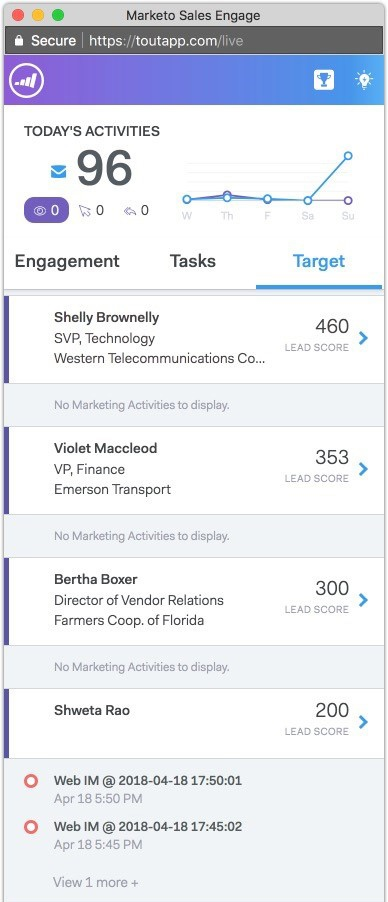

# Live Feed Overview {#live-feed-overview}

The Live Feed is a floating window that can be launched from the web application or the Gmail plug-in, and offers a real-time look at prospect engagement.

## Engagement Tab {#engagement-tab}

See engagement (views, clicks, and replies) with your MSE emails in real time.

People marked with purple are engaging with your marketing content. These people may not exist in MSE. You can click the down arrow to add them, and get a list of other quick actions.

People marked with a blue line represent engagement with emails sent through MSE.

>[!NOTE]
>
>Overall, we determine locations as accurately as we can based on IP tracking. Unfortunately, it isn't an exact science. If we get the location wrong for one of your recipients, here are a couple of options as to what may have happened:
>
>* If your recipient was logged-in to the wireless network for a company that has its IT headquarters in another city or country, we'd log that location rather than the recipient's current locale.
>* If your email was forwarded or opened by someone in the CC/BCC field, we try to accurately display the location of those people.
>

## Tasks Tab {#tasks-tab}

Quickly check your to-do list right from the Live Feed.

Create new or manage open tasks.

Filter on today, tomorrow, today *and* tomorrow, or next 7 days.

>[!NOTE]
>
>You cannot use the custom date filter in the Live Feed, but you can in the web application.

Use quick action buttons to quickly make a call, send an email, or navigate to a person's Linkedin profile. 

## Target Tab {#target-tab}

See your top people (ordered from highest to lowest) ranked by lead score. The lead score is pulled over from your Marketo instance.

* Leads will be generated when their person score increases in Marketo.
* We show the top 50 leads.
* You will only see the people that have been assigned to you in Salesforce.

## Icon Glossary {#icon-glossary}

<table> 
 <colgroup> 
  <col> 
  <col> 
 </colgroup> 
 <tbody> 
  <tr> 
   <td> 
    
 
     

 
    
</td> 
   <td>
Someone viewed your email
</td> 
  </tr> 
  <tr> 
   <td> 
    
 
     

 
    
</td> 
   <td>
Someone clicked a link in your email
</td> 
  </tr> 
  <tr> 
   <td> 
    
 
     

 
    
</td> 
   <td>
Someone replied to your email
</td> 
  </tr> 
  <tr> 
   <td colspan="1"> 
    
 
     

 
    
</td> 
   <td colspan="1">Any notification listed under Interesting Moments, including Email, Web, and Milestones</td> 
  </tr> 
 </tbody> 
</table>

>[!NOTE]
>
>If you're seeing someone view your email over and over in your Live Feed, they could have forwarded the email to additional recipients. This is most likely the case if you notice the location start to change for those views.

