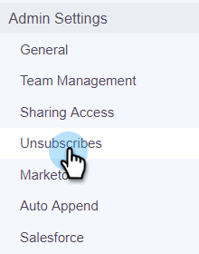

# Marketo Unsubscribe Check {#marketo-unsubscribe-check}

The Marketo Unsubscribe Check uses your team's connection to Marketo to prevent emails from going to people who are unsubscribed in Marketo's Lead Management system. When a sales user sends an email with Sales Connect, an API call will be made to Marketo to check if the email ID is unsubscribed. If it is, we will block the email from being sent.

>[!NOTE]
>
>**Admin Permissions Required**

## Turning it On {#turning-it-on}

1. In the web application, click the gear icon and select **Settings**.

   

1. Under Admin Settings, click **Unsubscribes**.

   

1. Click **Integrations**.

   

1. In the Marketo Unsubscribe Check section, click the slider to activate the check.

   

## Things to Know {#things-to-know}

The Marketo Unsubscribe check...

* Does not count against your API limits
* Requires a Marketo connection be established
* Is a global setting
* Blocks emails sent from the web application, email clients, and Salesforce
