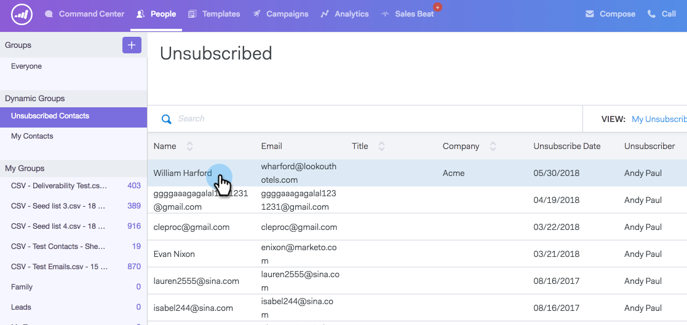

# Resubscribing an Unsubscribe {#resubscribing-an-unsubscribe}

Sometimes people want to opt back into receiving emails. Here's how to make unsubscribes mailable again.

>[!NOTE]
>
>**Admin Permissions Required**

>[!CAUTION]
>
>Before resubscribing someone, you should be able to demonstrate that the authorization to resubscribe them is documented and in compliance with all applicable laws.

>[!NOTE]
>
>If you have unsubscribe sync turned on you must remove the unsubscribe from ToutApp and uncheck the opt out in Salesforce for the person record to not sync again.

1. Go to the [web application](https://toutapp.com/login) and click **People**.

1. Select the person to open the person details view.

   

1. Click the three dots in the person details view and select **Remove Unsubscribe**.

   

1. Select the reason why the person is being opted back in to receive emails, then click **Remove Unsubscribe**.

   
