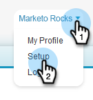

# Syncing Unsubscribes with [!DNL Salesforce] {#syncing-unsubscribes-with-salesforce}

## Requirements for Unsubscribes to Sync to [!DNL Salesforce] {#requirements-for-unsubscribes-to-sync-to-salesforce}

* Unsubscribe Sync must be enabled (for nightly sync)
* Opt Out field must be installed in [!DNL Salesforce]
* Person records in [!DNL Sales Connect] must have a [!DNL Salesforce] ID

**Push Unsubscribes**

When an unsubscribe is collected in [!DNL Sales Connect], we push it to [!DNL Salesforce] in real-time and update either of the Opt Out fields you have selected to sync with. If you've disabled the [!DNL Salesforce] sync, we will still push the unsubscribe over to the email opt out.

**Unsubscribe Sync**

When you've enabled the unsubscribe sync (Step 3 below) you will be turning on the nightly sync. The sync occurs once a day around 8:00 pm PST. It will bidirectionally sync all unsubscribes in MSE/ToutApp with the Opt Out field in [!DNL Salesforce].

## Configure Unsubscribe Sync to [!DNL Salesforce] {#configure-unsubscribe-sync-to-salesforce}

Users can decide whether they want to sync their unsubscribes with the standard Email Opt Out field that Marketo can also sync with, or they can sync with the Marketo Sales Opt Out field so that Sales unsubscribes and Marketing unsubscribes can be differentiated.

1. Go to the [web application](https://toutapp.com/login), click the gear icon and select **[!UICONTROL Settings]**.

   

1. Under [!UICONTROL Admin Settings] select **[!UICONTROL Unsubscribes]**.

   

1. Click **[!UICONTROL Syncing to Salesforce]**, then enable the nightly sync.

   

1. Select the field you'd like to sync to.

   

   | Field | Description |
   |---|---|
   | **[!UICONTROL Sync to Salesforce Opt Out field]** |Selected by default, only updates [!DNL Salesforce] Opt Out field. |
   | **[!UICONTROL Sync to Marketo Sales Opt Out field]** |If you want to separate Sales and Marketing unsubscribes, choose this option to update additional [Marketo Sales Opt Out field.](#msoo) |

## Installing the Opt Out field in the Page Layout {#installing-the-opt-out-field-in-the-page-layout}

**Email Opt Out** 
  
Email Opt Out is a standard field in [!DNL Salesforce] that's available to install from [!DNL Salesforce]. You need to be a [!DNL Salesforce] Admin to install it.

1. Go to [Salesforce.com](https://salesforce.com) and sign in.

   

1. Click your username and select **[!UICONTROL Setup]**.

   

1. In the quick find box search for either Contact or Lead. In this scenario we're installing the field to the Contact page layout, but you'll want to install for both person records.

   

1. Select **[!UICONTROL Page Layouts]**.

   

1. Select **[!UICONTROL Edit]** next to the page layout you would like to add the field to.

   

1. Select **[!UICONTROL Fields]**.

   

1. Drag and drop [!UICONTROL Email Opt Out] into the page layout.

   

1. Click **[!UICONTROL Save]**.

   

## Marketo Sales Opt Out {#marketo-sales-opt-out}

The Marketo Sales Opt Out field is a custom field that is available to users that have installed the Marketo [!DNL Sales Connect] Customizations.

Once you have successfully installed the the Marketo [!DNL Sales Connect] Customizations into [!DNL Salesforce] you will see the Marketo Sales Opt Out field available to you.
