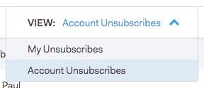

# Unsubscribe Group {#unsubscribe-group}

See and manage all of your unsubscribed people in one place.

Use the search bar to look up any unsubscribed people.

If you are an admin, you can go to the unsubscribe group to filter by [!UICONTROL Account Unsubscribes] and see all of the unsubscribes that have been collected in your people database.

