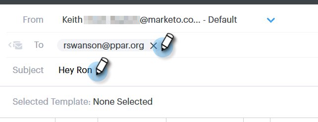
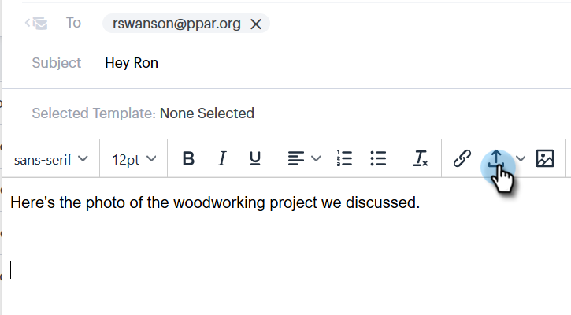
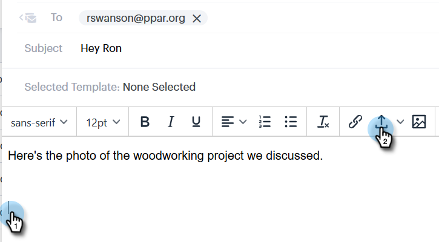
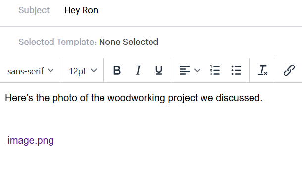

# Add an Attachment or Trackable Content to Your Email {#add-an-attachment-or-trackable-content-to-your-email}

When sending an email through [!DNL Sales Connect], you have the option of adding a file as an attachment, or making a file a downloadable (and trackable) link.

>[!NOTE]
>
>Typically, any file over 20MB will be too large to be delivered. The size of an attachment you can send via email varies depending on the email delivery channel you’re using.

## Add an Attachment {#add-an-attachment}

1. Create your email draft (there are multiple ways to do this, in this example we're choosing **[!UICONTROL Compose]** in the header).

   

1. Populate the [!UICONTROL To] field and enter a [!UICONTROL Subject].

   

1. Click the attachment icon.

   

1. Select the file you want to attach and click **[!UICONTROL Insert]**.

   

   >[!NOTE]
   >
   >If you need to upload a file, click the **Upload Content** button in the upper-right of the window.

   

The attachment appears at the bottom of your email.

## Add Trackable Content {#add-trackable-content}

1. Create your email draft (there are multiple ways to do this, in this example we're choosing the [!UICONTROL Compose] window).

   

1. Populate the [!UICONTROL To] field and enter a [!UICONTROL Subject].

   

1. Click the spot in the email you want the trackable content to appear and click the attachment icon.

   

1. Select the content you want added, click the **[!UICONTROL Content is tracked]** slider, and click **[!UICONTROL Insert]**.

   

   >[!NOTE]
   >
   >If you need to upload a file, click the **Upload Content** button in the upper-right of the window.

   The content appears as a link in your email. The recipient can click the link to download the content.

   

   >[!NOTE]
   >
   >Users will be notified in the Live Feed when people are viewing their tracked content. Users can also see the highest performing content in the content section of the Analytics page.
