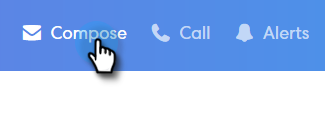
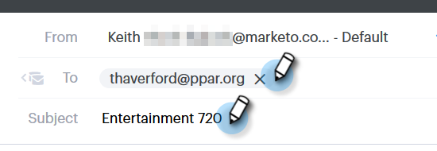
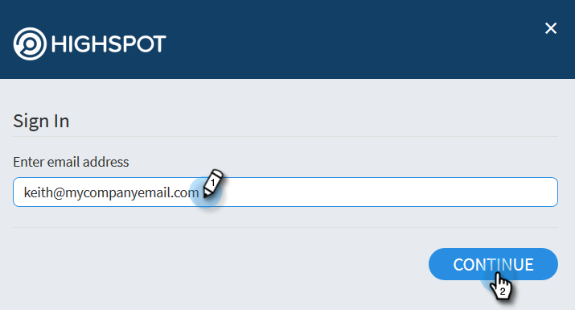

# Adding Highspot Content to Your Email {#adding-highspot-content-to-your-email}

If you're a Highspot customer, you can easily insert Highspot content into your Sales Connect emails.

1. Create your email draft (there are multiple ways to do this, in this example we're choosing **Compose** in the header).

   

1. Populate the To field and enter a Subject.

   

1. Click the spot in the email where you want the Highspot content inserted. Click the arrow drop-down (next to the attachment icon) and select **Highspot**.

   

1. Log-in to your Highspot account.

   

1. Select your desired content and click the **Add Content** button.

   

   >[!NOTE]
   >
   >If you don't see the content you want listed, use the Search bar at the top.

   

The content appears as a link in your email. The recipient can click the link to view/download the content.
