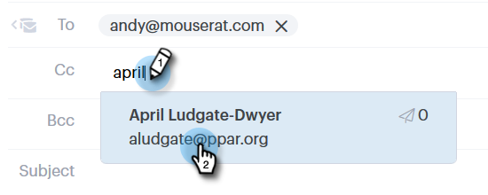

# Sending a Tracked Email {#sending-a-tracked-email}

Sending a Tracked Email - Marketo Docs - Product Documentation

When sending an email with Marketo Sales Connect, views (email opens) and clicks (clicked links) will be tracked.

>[!NOTE]
>
>**Prerequisites**
>
>You'll need to have an identity verified and an email delivery channel set up before sending a tracked email.
>
>* [Verify your email address](http://docs.marketo.com/x/ewPh)
>* Set up a Delivery Channel for [Outlook](http://docs.marketo.com/x/Z4AOAQ) or [Gmail](http://docs.marketo.com/x/kYMOAQ)
>

1. Create your email draft (there are multiple ways to do this, in this example we're choosing **Compose** in the header).

   

1. Enter the name or email of a recipient in the **To** field.

   

   >[!NOTE]
   >
   >You can only have one person in the To field.

1. Add any recipients you'd like to CC or BCC in the respective fields.

   

   >[!NOTE]
   >
   >If someone who's been CC’d or BCC’d opens the email, that open will be recorded as a view on the record of the person in the **To** field.

1. Add a subject line.

   

   >[!NOTE]
   >
   >A subject line and recipient is required to send the email. We will **automatically save your draft** once a subject line and recipient have been added.

1. Compose your email using the editor. Click **Send** (or [Schedule](http://docs.marketo.com/x/GAQ6Ag), if you prefer) when done.

   

   >[!NOTE]
   >
   >**Related Articles**
   >
   >    
   >    
   >    * [Scheduling an Email](http://docs.marketo.com/x/GAQ6Ag)
   >    * [Dynamic Fields](http://docs.marketo.com/x/wwDb)
   >    * [Using Templates](http://docs.marketo.com/display/DOCS/Templates)
   >    
   >

