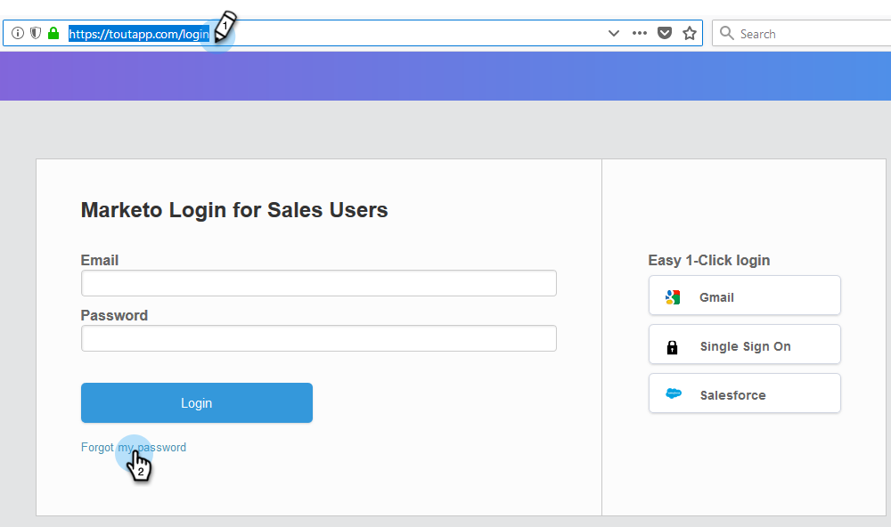
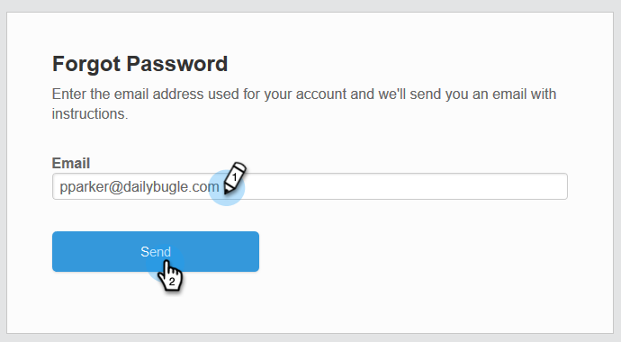
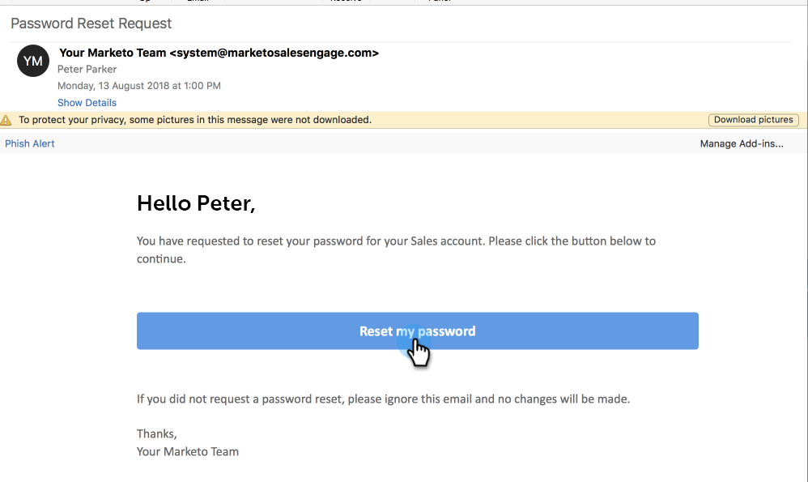
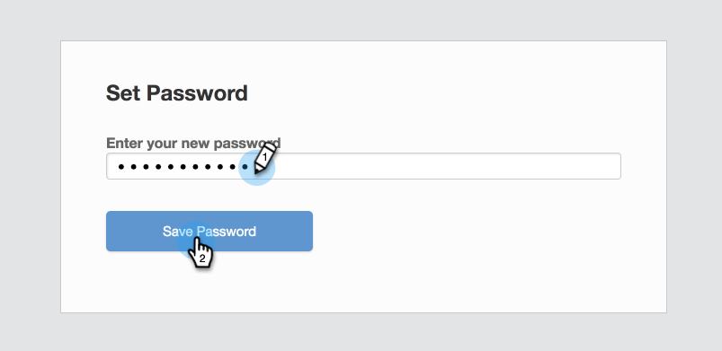

# How Do I Change My Password? {#how-do-i-change-my-password}

Follow these steps to change your password.

1. Navigate to the Sales Connect [log-in page](http://toutapp.com/login) and click **Forgot my password**.

   

1. Enter the email address associated with the account and click **Send**.

   

1. We will send an email to verify the account owner wants to change the password. Click **Reset my password**.

   

   >[!NOTE]
   >
   >Be sure to check your Spam folder too, as this email can sometimes end up there.

1. Enter your new password and click **Save Password**.

   

