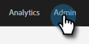
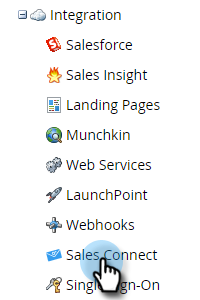
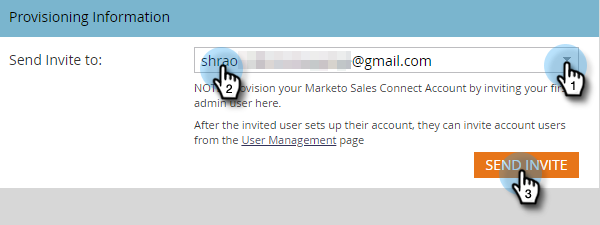

# Accessing Your New Sales Connect Instance {#accessing-your-new-sales-connect-instance}

>[!NOTE]
>
>**Admin permissions required.**

Once Sales Connect has been purchased, a new integration page will appear in your Marketo instance. Use this page to invite your first user and provision their Sales Connect instance.

1. In Marketo, click **Admin**.

   

1. Click **Sales Connect**.

   

1. Select from a list of Marketo admins to invite and click **Send Invite**.

   

The user will receive an email with steps to get access to the Sales Connect account.

>[!NOTE]
>
>Additional users will **not** be added through Marketo and will instead be added through Sales Connect’s User Management page. [Click here](/help/marketo/product-docs/marketo-sales-connect/admin/invite-users.md) to learn more about adding additional users.
