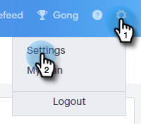
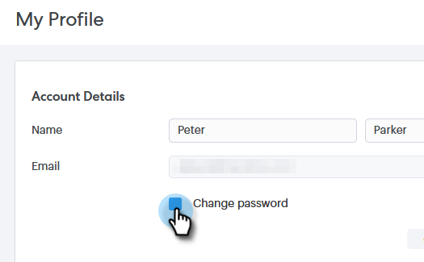
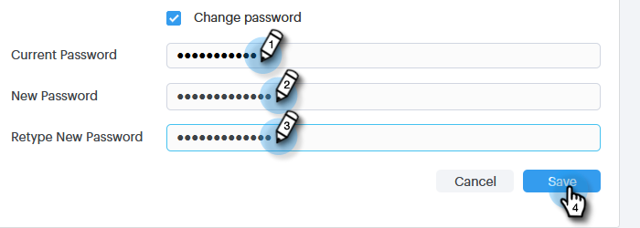
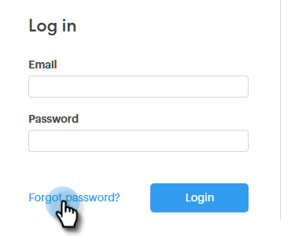
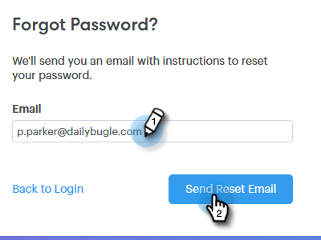
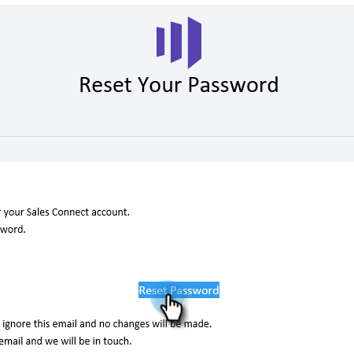
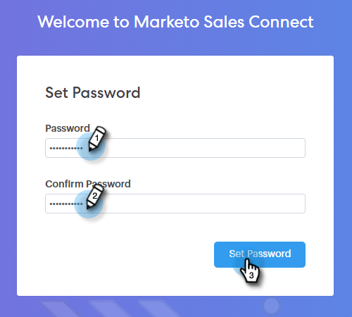

# Change Your Sales Connect Password {#change-your-sales-connect-password}

Need to change your password? Here's how.

## Change Your Password While Signed In {#change-your-password-while-signed-in}

1. Click the gear icon and select **Settings**.

   

1. Your My Profile page opens by default. Under Account Details, select the **Change password** checkbox.

   

1. Enter your current password. Then enter your new one, and re-type it making sure they match. Click **Save** when done.

   

>[!NOTE]
>
>Passwords must:
>
>* Contain at least nine characters
>* Use mixed case (both UPPER and lower)
>* Include a number
>* Use a special character

## Change Your Password While Signed Out {#change-your-password-while-signed-out}

1. Navigate to the [Sales Connect log-in](https://toutapp.com/login) page and click **Forgot password**.

   

1. Enter the email address associated with the account and click **Send Reset Email**.

   

1. We will send an email to verify the account owner wants to change the password. Click **Reset Password**.

   

   >[!NOTE]
   >
   >Be sure to check your Spam folder too, as this email can sometimes end up there.

1. Enter and confirm your new password. Click **Set Password** when done.

   
