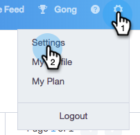
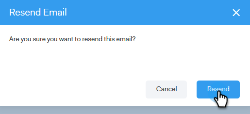

# Verify Your Email {#verify-your-email}

If you have an email identity that is not verified, follow the steps below.

1. Click the gear icon on the top right and choose **[!UICONTROL Settings]**.

   

1. Under [!UICONTROL My Account], click **[!UICONTROL Email Settings]**.

   

1. Under [!UICONTROL Address and Signature], find the email identity you’d like to verify and click **[!UICONTROL Resend Verify Email]**. A new verification email will be sent.

   

1. Click **[!UICONTROL Resend]**.

   

1. The recipient then opens the email and follows the steps to verify the email identity.

   
