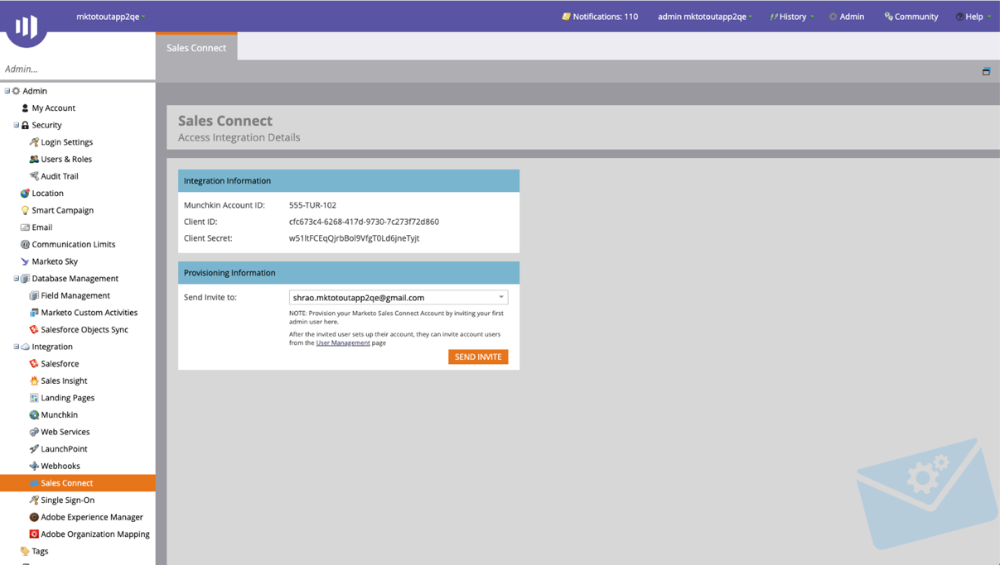

# Getting Started Guide for Sales Connect Admins {#getting-started-guide-for-sales-connect-admins}

This document will take you through the initial steps for setting up your new Sales Connect instance. Some of these steps will require access as a Marketo admin, Salesforce admin, and Sales Connect admin. Follow our guides below to complete your instance setup.

>[!NOTE]
>
>**Admin permissions required.**

## Accessing your new Marketo Sales Connect Account {#accessing-your-new-marketo-sales-connect-account}

If you have purchased Marketo Sales Connect, access to your instance will be provisioned from Marketo’s admin section. [Click here](/help/marketo/product-docs/marketo-sales-connect/getting-started/accessing-your-new-sales-connect-instance.md) to see instructions on how a Marketo admin can provision access to your new instance.  

## Inviting and Managing Users {#inviting-and-managing-users}

Once you have provisioned your Marketo Sales Connect account from Marketo and invited your first admin user, that admin user can invite additional users from the Marketo Sales Connect user management page. [Click here](/help/marketo/product-docs/marketo-sales-connect/admin/invite-users.md) to see how to invite users from the user management page.

## Connecting to Salesforce {#connecting-to-salesforce}

All users will individually need to connect to Salesforce in order to enable log sales activities to salesforce such as emails, calls, and tasks. However, when you connect to Salesforce as an admin you will have the opportunity to configure your activity logging settings for your entire team, so that global logging settings will be applied to all Sales Connect users.

To connect your Sales Connect instance to your Salesforce instance, as an Admin or a non-Admin, follow the steps in [this article](/help/marketo/product-docs/marketo-sales-connect/crm/salesforce-integration/connect-your-sales-connect-account-to-salesforce.md).

## Connecting to Marketo {#connecting-to-marketo}

Connecting to Marketo will enable your sellers to harness the power of marketing automation and marketing insights in their prospecting efforts. The following features require you to setup an integration with Marketo.

* Share [marketing campaigns](/help/marketo/product-docs/marketo-sales-connect/marketo/make-a-campaign-visible-to-sales-connect-users.md) with sellers
* Push [Interesting Moments](/help/marketo/product-docs/marketo-sales-connect/marketo/interesting-moments-in-sales-connect.md) to the Live Feed
* Logging sales activities to Marketo

To learn more about how to connect to Marketo and grant sales users access to the connection, click here.  

## Installing Salesforce Customization Package {#installing-salesforce-customization-package}

Part of ensuring sales is enabled for success means having the right capabilities in their primary workspace. The Sales Connect customization package allows engagement capabilities and key sales activity attributes to be accessible from Salesforce.  

To learn more about installing the Sales Connect Customization [click here](/help/marketo/product-docs/marketo-sales-connect/crm/salesforce-customization/sales-connect-customizations-for-crm.md).

## Testing in Sandbox {#testing-in-sandbox}

For teams who want to test Marketo Sales Connect with their Marketo Sandbox, an additional Sales Connect account can be provisioned upon request. This is only for customers who have purchased a Marketo Sandbox, or those who have it as part of their Marketo bundle. If you’re interested in acquiring a Sandbox, please contact your Marketo Account Manager.

>[!NOTE]
>
>You cannot provision a Sales Connect account with the same email ID to multiple instances. This means if you want to have an extra Sales Connect account to test with your Marketo Sandbox instance, you’ll need to use a different email ID in each of the accounts.

>[!MORELIKETHIS]
>
>[Admin privileges](/help/marketo/product-docs/marketo-sales-connect/admin/user-access-details.md)
