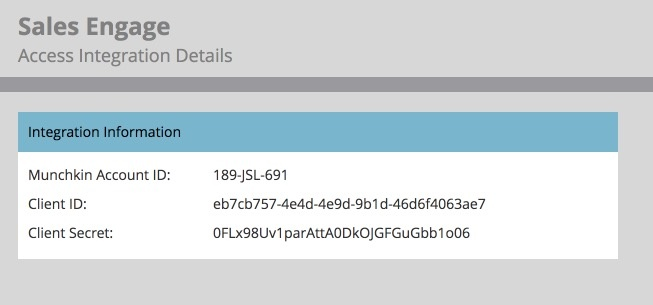
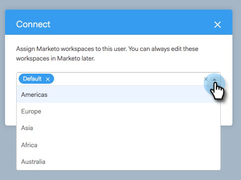

# Getting Started with Sales Connect {#getting-started-with-sales-connect}

If you would rather watch these steps than read them, skip straight to the [Video Instructions below](#video).

>[!AVAILABILITY]
>
>Not all customers have purchased this functionality. Contact your Customer Success Manager for more information.

## What You Need to Get Started {#what-you-need-to-get-started}

* Marketo subscription
* Sales Connect subscription
* Salesforce subscription (with API calls and Apex Classes enabled)

## Who You Need to Get Started {#who-you-need-to-get-started}

* Marketo Admin user  
* Sales Connect Admin user  
* Salesforce Admin  
* Sales Connect users

## Sales Connect Admins {#sales-connect-admins}

You'll receive an email from Marketo with a link to reset your password. After you create a new password, log in to Sales Connect.

To complete setup, you must do the following:

* [Connect Sales Connect and Salesforce](#connect-your-sales-connect-account-to-salesforce)
* [Acquire Credentials Prior to Connecting Sales Connect with Marketo](#acquiring-credentials-prior-to-connecting-sales-connect-with-marketo)
* [Connect Sales Connect with Marketo](#connect-sales-connect-to-marketo)
* [Invite/Provision Users](#invite-provision-users)

Optionally, you can also:

* [Test Sales Connect in your Sandbox](#test-sales-connect-in-your-sandbox)

## Connect Your Sales Connect Account to Salesforce {#connect-your-sales-connect-account-to-salesforce}

To connect your Sales Connect account to your Salesforce account, as an Admin or a non-Admin, follow the steps in [this article](/help/marketo/product-docs/marketo-sales-connect/crm/salesforce-integration/connect-your-sales-connect-account-to-salesforce.md).

>[!NOTE]
>
>The instance of Salesforce you connect to must be the same instance that is (or will be) connected to Marketo.

## Acquiring Credentials Prior to Connecting Sales Connect with Marketo {#acquiring-credentials-prior-to-connecting-sales-connect-with-marketo}

You'll need to get a set of credentials from within Marketo. These credentials will be used later by the Sales Connect Admin to connect Marketo with Sales Connect.

1. In Marketo, click **Admin**.

   

1. In the tree, click **Sales Connect**.

   

1. Select and send the following Marketo credentials to your Sales Connect Admin: Munchkin ID, Client ID, Client Secret.

   

   >[!NOTE]
   >
   >When you copy and paste the above info, make sure no spaces get added.

## Connect Sales Connect to Marketo {#connect-sales-connect-to-marketo}

1. In Sales Connect, click the gear icon and select **Settings**.

   

1. Under Admin Settings, select **Marketo**.

   

1. Input the Marketo credentials provided by the Marketo Admin and click **Connect**.

   

## Invite/Provision Users {#invite-provision-users}

If any users already exist on your account (previously from ToutApp), they'll show up in the **Team Access** tab of the Marketo section of Sales Connect.

You can provision your team as a Marketo Sales Connect User from this page. If you've never used ToutApp, or have yet to invite users, follow the steps in [this article](/help/marketo/product-docs/marketo-sales-connect/admin/invite-users.md).

>[!CAUTION]
>
>Please wait ten minutes after connecting Sales Connect with Marketo before performing these steps.

1. Select one or more users, then click **Connect**.

   >[!NOTE]
   >
   >You can only do the workspace assignment once at the time of inviting users. After it's set, you'll have to disconnect the user in order to change it.

   

1. If your Marketo subscription has workspaces enabled, you'll be able to assign workspaces to each user or set of users in bulk. If no workspaces are selected, we’ll assign them to the Default Marketo workspace.

   

1. Click the Workspace drop-down, select your desired workspace(s), and click **Connect**.

   

   >[!NOTE]
   >
   >If you want to add new users, go to the Team Management section of Admin Settings and click the **Invite Users** button.

You can additional users from the Team Management page and follow the steps above to get them connected.

## Test Sales Connect in your Sandbox {#test-sales-connect-in-your-sandbox}

For teams who want to test Marketo Sales Connect with their Marketo Sandbox, an additional Sales Connect account can be provisioned upon request. This is only for customers who have purchased a Marketo Sandbox, or those who have it as part of their Marketo bundle. If you're interested in acquiring a Sandbox, please contact your Marketo Account Manager.

>[!NOTE]
>
>You cannot provision a Sales Connect account with the same email ID to multiple instances. This means if you want to have an extra Sales Connect account to test with your Marketo Sandbox instance, you'll need to use a different email ID in each of the accounts.
