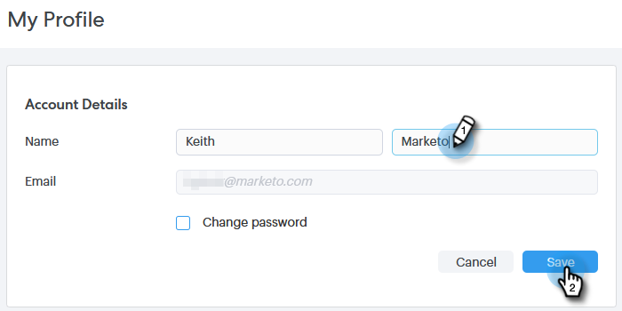

# My Profile Page {#my-profile-page}

In your My Profile page you can update your name, your account's language/locale/time zone, and also change your password.

## Account Details {#account-details}

Here's where you can update your name and/or password.

1. Click the gear icon and select **Settings**.

   

1. Your My Profile page opens by default. To update your name, simply type in the changes and click **Save**.

   

>[!NOTE]
>
>Your email address is set to view only. If you need that changed too, please contact [Marketo Support](https://nation.marketo.com/t5/Support/ct-p/Support).

You can also change your password in this section. The steps are outlined in this doc.

## Your Integrations {#your-integrations}

On the right side of the page, the Your Integrations section provides the status of all of your account's connections.

   

>[!NOTE]
>
>If you're using Exchange On Prem with Sales Connect, it will not update the Delivery Channel (1st line item) or Reply Tracking (2nd line item) integration health checks. We are working to support this in a future release.

## Time Zone {#time-zone}

Here's how to change your account's language, locale, and/or time zone.

>[!NOTE]
>
>Supported languages: English, French, German, Japanese, Portuguese, Spanish.

1. Click the gear icon and select **Settings**.

   

1. To change your language, click the **Language** drop-down and make your choice.

   

1. Locale here refers to the region in which that language is spoken. Click the **Locale** drop-down and make your choice.

   

1. Click the **Your Timezone** drop-down and make your choice.

   

1. Click **Save** when done.

   

Et voilà!
