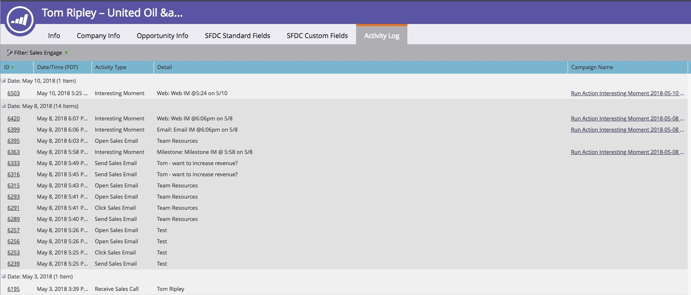

# Sales Connect Overview {#sales-connect-overview}

Marketo Sales Connect is a multi-faceted sales support solution with a variety of functions, helping you drive engagement throughout the sales cycle.

>[!AVAILABILITY]
>
>Not all customers have purchased this functionality. Contact your Customer Success Manager for more information.

## The Live Feed {#the-live-feed}

Sales reps can view [real-time engagement](/help/marketo/product-docs/marketo-sales-connect/email/the-live-feed/live-feed-overview.md) of both marketing and sales content.

## Person Detail View {#person-detail-view}

Access [detailed people stats](/help/marketo/product-docs/marketo-sales-connect/people/person-detail-view.md).

## See Results in Your Marketo Activity Log {#see-results-in-your-marketo-activity-log}

See how your prospects are engaging with your sales efforts.

<table> 
 <tbody> 
  <tr> 
   <th>Activity Type</th> 
   <th>Description</th> 
  </tr> 
  <tr> 
   <td>
Send Sales Email
</td> 
   <td>
User sent a sales email from MSE.
</td> 
  </tr> 
  <tr> 
   <td>
Open Sales Email
</td> 
   <td>
Lead opened a sales email sent from MSE.
</td> 
  </tr> 
  <tr> 
   <td>
Click Sales Email
</td> 
   <td>
Lead clicked on a link in a sales email sent from MSE.
</td> 
  </tr> 
  <tr> 
   <td colspan="1">
Receive Sales Email
</td> 
   <td colspan="1">
Lead received an email sent from MSE.
</td> 
  </tr> 
  <tr> 
   <td colspan="1">
Receive Sales Call
</td> 
   <td colspan="1">
Lead received a call from a salesperson using the <a href="/help/marketo/product-docs/marketo-sales-connect/phone/sales-phone-overview.md" rel="nofollow">Sales Phone</a>.
</td> 
  </tr> 
  <tr> 
   <td colspan="1">
Add to Sales Campaign
</td> 
   <td colspan="1">
Lead was added to a sales campaign created in MSE (in the Campaigns page).
</td> 
  </tr> 
  <tr> 
   <td colspan="1">
Removed From Sales Campaign
</td> 
   <td colspan="1">
Lead was removed from a sales campaign.
</td> 
  </tr> 
  <tr> 
   <td colspan="1">
Interesting moment
</td> 
   <td colspan="1">
Lead had an interesting moment generated in Marketo.
</td> 
  </tr> 
 </tbody> 
</table>

## Share Marketing Campaigns {#share-marketing-campaigns}

Create a simple smart campaign to give your sales users access to [Marketo campaign data](/help/marketo/product-docs/marketo-sales-connect/marketo/make-a-campaign-visible-to-sales-connect-users.md).

Ready to get started? For setup instructions, click the link below.

>[!MORELIKETHIS]
>
>[Getting Started with Sales Connect](/help/marketo/product-docs/marketo-sales-connect/getting-started/getting-started-with-sales-connect.md)
